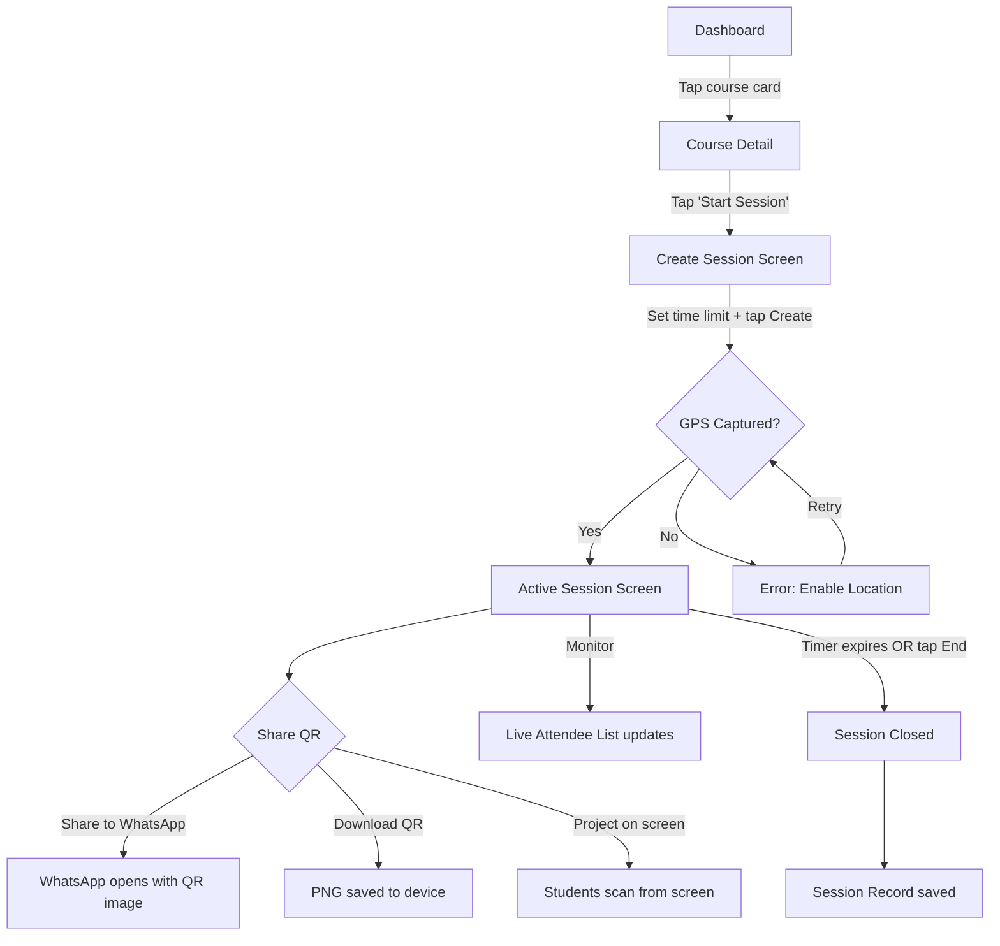
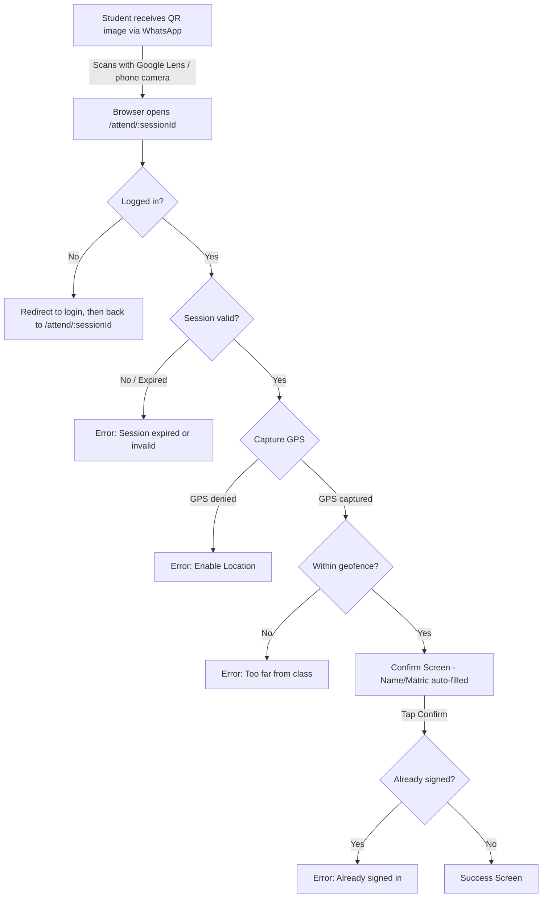

# Attendly — Information Architecture & Wireframes

**Version:** 1.0
**Date:** March 23, 2026

---

## 1. Site Map

```mermaid
graph TD
    LP[Landing Page] --> LOGIN[Login]
    LP --> REG_L[Register as Lecturer]
    LP --> REG_S[Register as Student]
    LOGIN --> FORGOT[Forgot Password]
    FORGOT --> RESET[Reset Password]

    LOGIN --> L_DASH[Lecturer Dashboard]
    LOGIN --> S_DASH[Student Dashboard]

    subgraph Lecturer ["Lecturer Flow"]
        L_DASH --> L_PROFILE[Profile Settings]
        L_DASH --> CREATE_C[Create Course Modal]
        L_DASH --> COURSE[Course Detail]
        COURSE --> EDIT_C[Edit Course]
        COURSE --> CREATE_S[Create Session]
        CREATE_S --> ACTIVE[Active Session]
        COURSE --> SESSION_REC[Session Record]
        COURSE --> ANALYTICS[Course Analytics]
        ANALYTICS --> EXPORT[Export CSV]
    end

    subgraph Student ["Student Flow"]
        S_DASH --> S_PROFILE[Profile Settings]
        S_DASH --> HISTORY[Attendance History]
        HISTORY --> COURSE_HIST[Course Detail History]
    end

    subgraph External ["External QR Scan"]
        QR_EXT[Student scans QR via Google Lens / phone camera]
        QR_EXT --> ATTEND[/attend/:sessionId page]
        ATTEND --> CONFIRM[Confirm Attendance]
        CONFIRM --> SUCCESS[Success Screen]
        CONFIRM --> ERROR[Error Screen]
    end
```

---

## 2. Navigation Structure

### Lecturer Navigation

| Location | Element | Action |
|---|---|---|
| Top bar | Attendly logo | → Dashboard |
| Top bar | Profile avatar | → Profile Settings |
| Dashboard | Course card | → Course Detail |
| Dashboard | "+ Create Course" button | → Create Course modal |
| Dashboard | FAB (QR+ icon) | → Quick Session Create |
| Course Detail | "Start Session" button | → Create Session |
| Course Detail | Session row | → Session Record |
| Course Detail | "Analytics" tab | → Course Analytics |
| Active Session | "Share to WhatsApp" | → Opens WhatsApp share |
| Active Session | "Download QR" | → Saves PNG |
| Active Session | "End Session" | → Closes session |

### Student Navigation

| Location | Element | Action |
|---|---|---|
| Top bar | Attendly logo | → Dashboard |
| Top bar | Profile avatar | → Profile Settings |
| Dashboard | Course card | → Attendance History for that course |
| External QR scan | Scans QR (Google Lens, phone camera) | → Redirects to `/attend/:sessionId` |
| Confirm screen | "Confirm Attendance" | → Submit + Success/Error |
| Success/Error | "Back to Dashboard" | → Dashboard |

---

## 3. Screen Inventory

### Public Screens

| Screen | Purpose | Key Components |
|---|---|---|
| **Landing Page** | Convert visitors to sign-ups | Hero, feature cards, dual CTAs |
| **Login** | Authenticate returning users | Email/matric field, password, "Forgot password" link |
| **Register (Lecturer)** | Onboard lecturers | Name, email, password fields |
| **Register (Student)** | Onboard students | Name, department, matric, email, gender, password fields |
| **Forgot Password** | Password recovery entry | Email field, submit button |
| **Reset Password** | Set new password | New password, confirm password |
| **Attend Page** (`/attend/:sessionId`) | Attendance entry point from QR scan | Login gate (if not logged in), auto GPS capture, confirm button |

### Lecturer Screens

| Screen | Purpose | Key Components |
|---|---|---|
| **Dashboard** | Course overview + quick actions | Course card list, create course button, FAB |
| **Create Course Modal** | Add new course | Course code, title fields, save button |
| **Course Detail** | Session history for a course | Session list, start session button, analytics tab |
| **Create Session** | Configure new session | Time limit input, geofence radius (V2), create button |
| **Active Session** | Monitor live attendance | QR code, WhatsApp/download buttons, timer, live attendee list, end button |
| **Session Record** | Review past session | Attendee table (name, matric, dept, time) |
| **Course Analytics** | Cumulative data | Stats row, per-student breakdown table, export button |
| **Profile Settings** | Manage account | Editable name, read-only email, change password |

### Student Screens

| Screen | Purpose | Key Components |
|---|---|---|
| **Dashboard** | Attendance overview | Course list with attendance % badges |
| **Confirm Attendance** (`/attend/:sessionId`) | Review + one-tap confirm (arrived from external QR scan) | Auto-filled name/matric, course info, confirm button |
| **Success Screen** | Confirmation feedback | Checkmark, course, date/time |
| **Error Screen** | Explain failure | Error icon, reason text, retry/back options |
| **Attendance History** | Per-course session list | Course card with %, session rows (present/absent) |
| **Profile Settings** | Manage account | Editable name/dept/gender, locked matric/email |

---

## 4. User Flows

### Flow 1: Lecturer Creates Session & Shares QR



### Flow 2: Student Signs Attendance (via External QR Scan)



---

## 5. Responsive Design

The application is fully responsive across all screen sizes:

| Breakpoint | Layout | Navigation |
|---|---|---|
| Mobile (< 768px) | Single column, stacked cards | Top bar with hamburger menu |
| Tablet (768–1024px) | 2-column card grid, stacked content | Collapsible sidebar |
| Desktop (> 1024px) | Sidebar + multi-column content | Persistent sidebar |

**Key responsive behaviors:**
- Dashboard course cards reflow from 1 → 2 → 3 columns
- Active session splits into two-column layout on desktop (QR left, attendees right)
- Tables become horizontally scrollable on small screens
- QR scanner uses full viewport on mobile, centered modal on desktop

---

## 6. Wireframes

### 6.1 Landing Page (Desktop)


### 6.2 Landing Page (Mobile)


### 6.3 Registration Forms


### 6.4 Lecturer Dashboard (Desktop)


### 6.5 Lecturer Dashboard (Mobile)


### 6.6 Active Session (Desktop)


### 6.7 Active Session (Mobile)


### 6.8 Student Scan Flow (Mobile)


### 6.9 Course Analytics (Desktop)


### 6.10 Attendance Records (Mobile)


---

## 7. Design Tokens (Reference for Implementation)

| Token | Value |
|---|---|
| Primary color | `#4A7C2E` (FUNAAB-inspired forest green, modernized) |
| Primary hover | `#3D6825` |
| Primary light | `#E8F0E4` (tinted backgrounds) |
| Error color | `#C62828` (red) |
| Warning color | `#E65100` (amber) |
| Success color | `#2E7D32` |
| Background | `#FFFFFF` |
| Surface | `#F8F9FA` |
| Border color | `#E5E7EB` |
| Text primary | `#1A1A1A` |
| Text secondary | `#6B7280` |
| Border radius (cards) | `12px` |
| Border radius (buttons) | `8px` |
| Border radius (inputs) | `8px` |
| Font family | `Inter, system-ui, sans-serif` |
| Font size (body) | `14px / 16px` |
| Min touch target | `44 x 44px` |
| Sidebar width (desktop) | `240px` |
| Max content width | `1200px` |

### Design Principles

- **No emojis** — use line icons (Lucide, Phosphor, or similar) throughout
- **Minimalistic** — generous white space, clean borders, flat surfaces
- **Modern** — subtle shadows, rounded corners, smooth transitions
- **Responsive** — mobile-first CSS, breakpoints at 768px and 1024px
