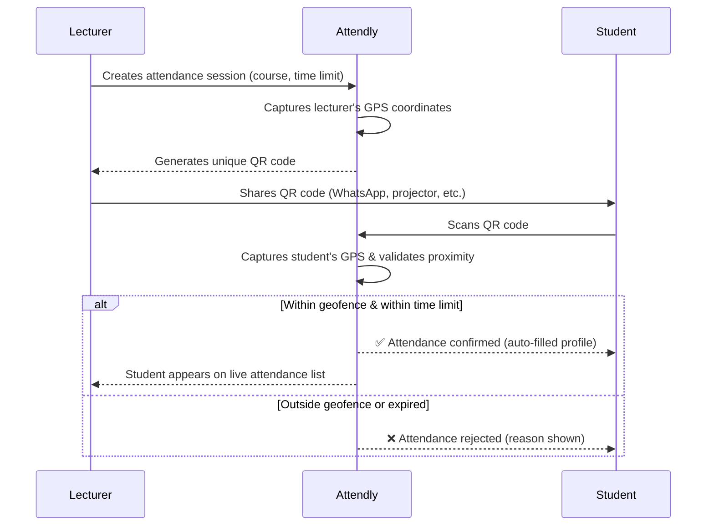

# Attendly — Product Concept & User Stories

> *"With Attendly, attendance is as simple as a single scan."*

---

## Refined Product Concept

**Attendly** is a location-smart, QR-based attendance system built for universities. It eliminates manual roll calls, sign-in sheets, and the fraud that plagues them — replacing it all with a single scan that is verified by proximity.

### How It Works

### Core Principles

| Principle | Description |
|---|---|
| **One-scan simplicity** | Students tap once. No typing, no forms. Name and matric number auto-fill from their profile. |
| **Location integrity** | GPS geofencing ensures only physically present students can sign in. No proxying from the hostel. |
| **Time-bound sessions** | Each session has a countdown. Late? You're marked late — or locked out. |
| **Zero infrastructure** | No Bluetooth beacons, no NFC tags. Just phones and GPS. |
| **Course-level analytics** | Lecturers get session-by-session and cumulative attendance data per course. |

### Anti-Fraud Measures (Refined)

The raw idea is solid, but we need to tighten these edges:

1. **Dynamic QR codes** — Each QR code is unique per session + time-windowed. Screenshotting and forwarding a QR doesn't help if the recipient isn't physically present (GPS check blocks them).
2. **Geofence radius** — Configurable by the lecturer (default: ~30–50 meters). Tight enough to mean "in this building/room," loose enough to handle GPS drift.
3. **One device, one sign-in** — A student account can only sign attendance from one device per session. Prevents one student signing in for five friends on five phones.
4. **Session expiry** — After the time limit, the QR becomes invalid. The lecturer controls the window.

---

## User Roles

| Role | Description |
|---|---|
| **Lecturer** | Creates courses, opens attendance sessions, shares QR codes, reviews attendance records. |
| **Student** | Registers with university details, scans QR codes to mark attendance, views own attendance history. |

---

## User Stories — Lecturer

### Registration & Profile

| ID | Story | Acceptance Criteria |
|---|---|---|
| L-01 | As a lecturer, I want to **sign up with my full name, email, and password** so that I have a secure account on the platform. | Form validates all fields; email must be unique across all users; password meets minimum strength; account is created and verified. |
| L-02 | As a lecturer, I want to **log in with my email and password** so that I can access my dashboard. | Valid credentials → dashboard; invalid → clear error message. |
| L-03 | As a lecturer, I want to **reset my password via email** so that I can recover my account if I forget my credentials. | Reset link sent to registered email; link expires after 30 min; password updated successfully. |
| L-04 | As a lecturer, I want to **edit my profile details** so that my information stays up to date. | Name is editable; email change requires re-verification. |

### Course Management

| ID | Story | Acceptance Criteria |
|---|---|---|
| L-05 | As a lecturer, I want to **create a course by entering its code and title** so that I can organize attendance by course. | Course is created with a unique code under the lecturer's account; appears on dashboard immediately. |
| L-06 | As a lecturer, I want to **view a list of all my courses** so that I can select one to manage. | All created courses are listed with code, title, and last session date. |
| L-07 | As a lecturer, I want to **edit or archive a course** so that I can keep my course list relevant each semester. | Course details are editable; archived courses are hidden from the active list but data is preserved. |

### Attendance Session

| ID | Story | Acceptance Criteria |
|---|---|---|
| L-08 | As a lecturer, I want to **create an attendance session for a specific course while in class** by selecting the course and setting a time limit, so that students can sign in. | Session is created; lecturer's GPS location is captured at creation time; countdown timer starts. |
| L-09 | As a lecturer, I want the system to **generate a unique QR code for each session** so that I can share it with students. | QR code is unique, tied to the session, and encodes the session ID + location metadata. |
| L-10 | As a lecturer, I want to **download/share the QR code as an image** so that I can send it to the class WhatsApp group or project it on screen. | QR code is downloadable as PNG; shareable via native share (mobile) or copy-to-clipboard (web). |
| L-11 | As a lecturer, I want to **see a live list of students who have signed in** during an active session so that I can monitor turnout in real time. | List updates in real time; shows student name, matric number, and sign-in timestamp. |
| L-12 | As a lecturer, I want to **manually close a session before the timer expires** so that I can end attendance early if needed. | Session closes immediately; no further sign-ins accepted; data is saved. |
| L-13 | As a lecturer, I want the **session to auto-close when the time limit is reached** so that late arrivals are locked out. | QR code becomes invalid; students scanning after expiry see a clear "session expired" message. |

### Attendance Records & Analytics

| ID | Story | Acceptance Criteria |
|---|---|---|
| L-14 | As a lecturer, I want to **view the attendance record for each past session** so that I can see who showed up. | Displays list of attendees with name, matric number, department, and sign-in time. |
| L-15 | As a lecturer, I want to **see cumulative attendance statistics per course** (e.g., total sessions, average turnout, per-student attendance rate) so that I can identify chronically absent students. | Dashboard shows total sessions held, average attendance %, and per-student breakdown. |
| L-16 | As a lecturer, I want to **export attendance data as CSV/Excel** so that I can submit records to the department. | Export includes all session data for the selected course; downloadable as `.csv` or `.xlsx`. |

---

## User Stories — Student

### Registration & Profile

| ID | Story | Acceptance Criteria |
|---|---|---|
| S-01 | As a student, I want to **sign up with my full name, department, matric number, email, gender, and password** so that I have a verified profile. | All fields validated; email must be unique across all users; matric number must be unique among students; account created and email verified. |
| S-02 | As a student, I want to **log in with my email/matric number and password** so that I can access the app. | Supports login via either email or matric number. |
| S-03 | As a student, I want to **reset my password** so that I can recover access to my account. | Same flow as lecturer; reset link via email. |
| S-04 | As a student, I want to **edit my profile** so that I can keep my details current. | Name, department, and gender are editable; matric number and email are locked after registration (email changeable via re-verification). |

### Signing Attendance

| ID | Story | Acceptance Criteria |
|---|---|---|
| S-05 | As a student, I want to **scan the QR code shared by my lecturer** so that I can mark my attendance. | App opens camera/QR scanner; decodes the session info automatically. |
| S-06 | As a student, I want the system to **auto-fill my name and matric number** when I scan the code so that I don't have to type anything. | Profile details are pre-populated; student only has to tap "Confirm Attendance." |
| S-07 | As a student, I want the system to **verify my location** and only allow me to sign in if I'm physically near the class so that attendance is fair. | If within geofence → success; if outside → clear rejection message explaining why (e.g., "You are too far from the class location"). |
| S-08 | As a student, I want to **receive immediate confirmation** that my attendance was recorded so that I know it went through. | Success screen with course name, session date/time, and a ✅ confirmation. |
| S-09 | As a student, I want to **see a clear error message if the session has expired** so that I know I'm too late. | Error screen: "This session closed at [time]. Contact your lecturer." |

### Attendance History

| ID | Story | Acceptance Criteria |
|---|---|---|
| S-10 | As a student, I want to **view my attendance history per course** so that I can track my own record. | Lists all sessions for a course with status (Present / Absent). |
| S-11 | As a student, I want to **see my overall attendance percentage per course** so that I know where I stand. | Percentage is calculated and displayed prominently on the course detail screen. |

---

## Edge Cases & Considerations

| Scenario | Handling |
|---|---|
| Student has GPS turned off | Prompt to enable location services; block sign-in until GPS is active. |
| Poor GPS accuracy (indoors) | Use Wi-Fi-assisted location; consider a slightly wider geofence for indoor settings. The lecturer should be able to adjust this. |
| Lecturer forgets to close session | Auto-close at time limit handles this. |
| Student tries to sign in twice | System rejects duplicate sign-in for the same session; shows "Already signed in." |
| Multiple sessions for the same course on the same day | Each session has a unique ID; no conflict. |
| Student not registered for a course | For MVP, any student can scan any QR. Course enrollment enforcement can be a V2 feature. |

---

## What's Next

Once these user stories are approved, we move to:

1. **Information Architecture & Wireframes** — screen-by-screen layouts for both lecturer and student flows
2. **Technical Architecture** — tech stack, database schema, API design, geofencing strategy
3. **MVP Scope Definition** — what ships in V1 vs. what's deferred
4. **Implementation Plan** — sprint-level breakdown
