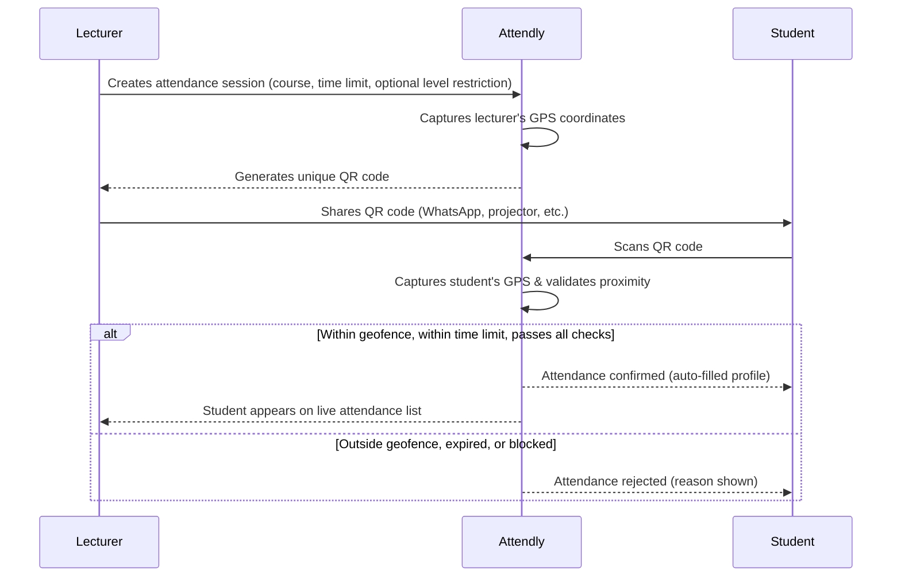

# Attendly — Product Concept & User Stories

> *"With Attendly, attendance is as simple as a single scan."*

---

## Refined Product Concept

**Attendly** is a location-smart, QR-based attendance system built for universities. It eliminates manual roll calls, sign-in sheets, and the fraud that plagues them — replacing it all with a single scan that is verified by proximity.

### How It Works

### Core Principles

| Principle | Description |
|---|---|
| **One-scan simplicity** | Students tap once. No typing, no forms. Name and matric number auto-fill from their profile. |
| **Location integrity** | GPS geofencing ensures only physically present students can sign in. No proxying from the hostel. |
| **Time-bound sessions** | Each session has a countdown. Sign-ins are rejected once the session closes or expires. |
| **Zero infrastructure** | No Bluetooth beacons, no NFC tags. Just phones and GPS. |
| **Course-level analytics** | Lecturers get session-by-session and cumulative attendance data per course. |

### Anti-Fraud Measures

1. **Dynamic QR codes** — Each QR code is unique per session and time-windowed. Forwarding a screenshot doesn't help if the recipient isn't physically present — the GPS check blocks them.
2. **Geofence radius** — Configurable by the lecturer (default: 250 metres, range: 50–500 m). Tight enough to mean "near this classroom," loose enough to handle GPS drift.
3. **Three-signal device binding** — Each session records the signing device's UUID (from `localStorage`), a browser fingerprint (FNV-1a hash of user agent, screen, timezone, hardware concurrency, and platform), and the client IP address. All three are enforced as unique constraints per session, so a single device cannot be used by multiple students even across incognito mode or cleared storage.
4. **Session expiry** — After the time limit, the QR becomes invalid and sign-ins are rejected.
5. **Enrollment enforcement** — If a lecturer uploads an enrollment list for a course, only students whose matric number is on the list can sign attendance.
6. **Level enforcement** — Sessions can optionally be restricted to a specific student level (100L–600L), blocking students from other years.

---

## User Roles

| Role | Description |
|---|---|
| **Lecturer** | Creates courses, manages enrollment lists, opens attendance sessions, shares QR codes, reviews and exports attendance records. |
| **Student** | Registers with university details, scans QR codes to mark attendance, views own attendance history. |

---

## User Stories — Lecturer

### Registration & Profile

| ID | Story | Acceptance Criteria |
|---|---|---|
| L-01 | As a lecturer, I want to **sign up with my full name, email, and password** so that I have a secure account on the platform. | Form validates all fields; email must be unique across all users; password is minimum 8 characters; account is created immediately. |
| L-02 | As a lecturer, I want to **log in with my email and password** so that I can access my dashboard. | Valid credentials → dashboard; invalid → clear error message. |
| L-03 | As a lecturer, I want to **reset my password via email** so that I can recover my account if I forget my credentials. | Reset link sent to registered email; link expires after 1 hour; password updated successfully; token is single-use. |
| L-04 | As a lecturer, I want to **edit my profile details** (name, department) so that my information stays up to date. | Name and department are editable; changes are saved immediately. |

### Course Management

| ID | Story | Acceptance Criteria |
|---|---|---|
| L-05 | As a lecturer, I want to **create a course by entering its code and title** so that I can organize attendance by course. | Course is created with a unique code under the lecturer's account; appears on dashboard immediately. |
| L-06 | As a lecturer, I want to **view a list of all my courses** so that I can select one to manage. | All active courses are listed with code, title, and session count. |
| L-07 | As a lecturer, I want to **edit or archive a course** so that I can keep my course list relevant each semester. | Course code and title are editable; archived courses are hidden from the active list but records are preserved. |
| L-08 | As a lecturer, I want to **import an enrollment list (CSV) for a course** so that only registered students can sign attendance. | CSV upload is accepted; matric numbers are stored against the course; once any enrollment exists, non-enrolled students are blocked from signing in. |
| L-09 | As a lecturer, I want to **clear the enrollment list for a course** so that I can lift the restriction (e.g. start of a new semester). | All enrollment records are removed; sign-in is open to any student again. |

### Attendance Session

| ID | Story | Acceptance Criteria |
|---|---|---|
| L-10 | As a lecturer, I want to **create an attendance session for a specific course while in class** by selecting the course and setting a time limit, so that students can sign in. | Session is created; lecturer's GPS location is captured at creation time; countdown timer starts; optional level restriction is set. |
| L-11 | As a lecturer, I want the system to **generate a unique QR code for each session** so that I can share it with students. | QR code is unique per session; encodes the attendance URL. |
| L-12 | As a lecturer, I want to **share the QR code via WhatsApp** (or download it as an image) so that I can distribute it to the class quickly. | One-tap WhatsApp share of QR image or attendance link; QR is also downloadable as PNG. |
| L-13 | As a lecturer, I want to **see a live list of students who have signed in** during an active session so that I can monitor turnout in real time. | List updates in real time via SSE; shows student name, matric number, department, distance from classroom, and sign-in timestamp. |
| L-14 | As a lecturer, I want to **manually mark a student as present** during a session so that students without a phone or internet access are not penalised. | Lecturer searches for a registered student by name or matric number; marks them present; record is flagged as manually marked; student appears in the live list. |
| L-15 | As a lecturer, I want to **manually close a session before the timer expires** so that I can end attendance early if needed. | Session closes immediately; no further sign-ins accepted; data is saved. |
| L-16 | As a lecturer, I want the **session to auto-close when the time limit is reached** so that late arrivals are locked out. | QR code becomes invalid; students scanning after expiry see a clear "session expired" message. |
| L-17 | As a lecturer, I want to **restrict a session to a specific student level** (e.g. 300L only) so that students from other years cannot sign. | Session is created with a level field; students whose level does not match receive a clear rejection. |

### Attendance Records & Analytics

| ID | Story | Acceptance Criteria |
|---|---|---|
| L-18 | As a lecturer, I want to **view the attendance record for each past session** so that I can see who showed up. | Displays list of attendees with name, matric number, department, distance from classroom, sign-in time, and whether they were manually marked. |
| L-19 | As a lecturer, I want to **see cumulative attendance statistics per course** (total sessions, per-student attendance rate) so that I can identify chronically absent students. | Dashboard shows total sessions held and per-student attended count and percentage. |
| L-20 | As a lecturer, I want to **export attendance data as CSV** so that I can submit records to the department. | Export includes all session data for the selected course with name, matric number, department, gender, sessions attended, total sessions, and percentage. |

---

## User Stories — Student

### Registration & Profile

| ID | Story | Acceptance Criteria |
|---|---|---|
| S-01 | As a student, I want to **sign up with my full name, department, matric number, email, level, gender, and password** so that I have a verified profile. | All fields validated; email must end in `@student.funaab.edu.ng`; email must be unique; matric number must be unique among students; account created immediately. |
| S-02 | As a student, I want to **log in with my email or matric number and password** so that I can access the app. | Either email or matric number accepted as identifier. |
| S-03 | As a student, I want to **reset my password** so that I can recover access to my account. | Same flow as lecturer; reset link via email, expires in 1 hour. |
| S-04 | As a student, I want to **edit my profile** so that I can keep my details current. | Name, department, gender, and level are editable; matric number and email are locked after registration. |

### Signing Attendance

| ID | Story | Acceptance Criteria |
|---|---|---|
| S-05 | As a student, I want to **scan the QR code shared by my lecturer** (via Google Lens or camera app) so that I can mark my attendance. | Scanning opens the attendance URL in the browser; session info loads automatically. |
| S-06 | As a student, I want the system to **auto-fill my name and matric number** when I open the attendance page so that I don't have to type anything. | Profile details are pre-populated from my account; I only tap "Confirm Attendance." |
| S-07 | As a student, I want the system to **verify my location** and only allow me to sign in if I'm physically near the class so that attendance is fair. | If within geofence → success; if outside → clear rejection message with the distance I am from the classroom. |
| S-08 | As a student, I want to **receive immediate confirmation** that my attendance was recorded so that I know it went through. | Success screen with course name, session date/time, and confirmation message. |
| S-09 | As a student, I want to **see a clear error message if the session has expired or I am blocked** so that I know what happened. | Distinct messages for: expired session, outside geofence, wrong level, not enrolled, already signed, device already used. |

### Attendance History

| ID | Story | Acceptance Criteria |
|---|---|---|
| S-10 | As a student, I want to **view my attendance history per course** so that I can track my own record. | Lists all sessions I signed for a course with date and time. |
| S-11 | As a student, I want to **see my overall attendance percentage per course** so that I know where I stand. | Percentage is calculated and displayed on the course detail screen. |

---

## Edge Cases & Considerations

| Scenario | Handling |
|---|---|
| Student has GPS turned off | Prompt to enable location services; block sign-in until GPS is active. |
| Poor GPS accuracy (indoors) | Use Wi-Fi-assisted location; lecturer can widen the geofence radius (up to 500 m) to account for indoor GPS drift. |
| Lecturer forgets to close session | Auto-close at time limit handles this. |
| Student tries to sign in twice | Rejected with "Already signed in." |
| Multiple sessions for the same course on the same day | Each session has a unique ID; no conflict. |
| Student without a phone or internet | Lecturer manually marks them present from the session page. |
| Student not on the enrollment list | Rejected with a clear message if the course has an active enrollment list; lecturer can manually mark them present or add them to the list. |
| One device used by multiple students | Rejected — device UUID, browser fingerprint, and IP address are all checked. The second student sees a "device already used" error. |
| Student's level does not match the session restriction | Rejected with a level mismatch message. |
