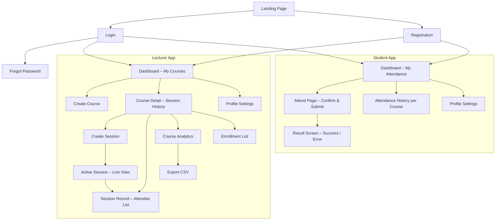
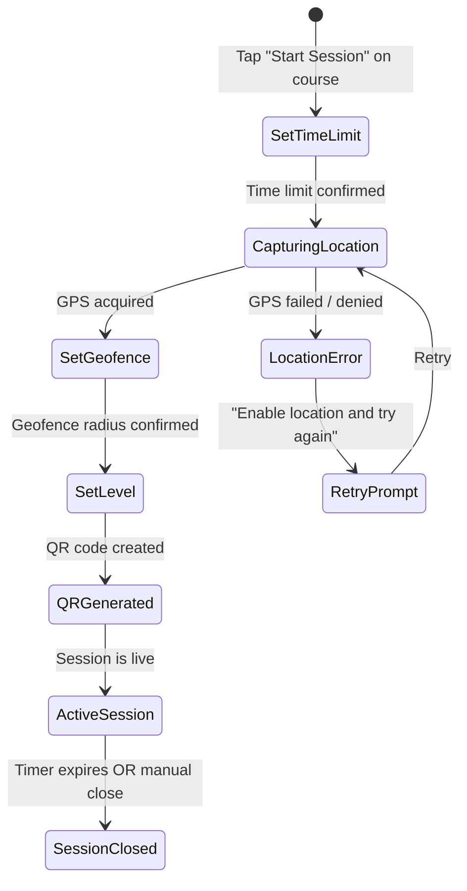
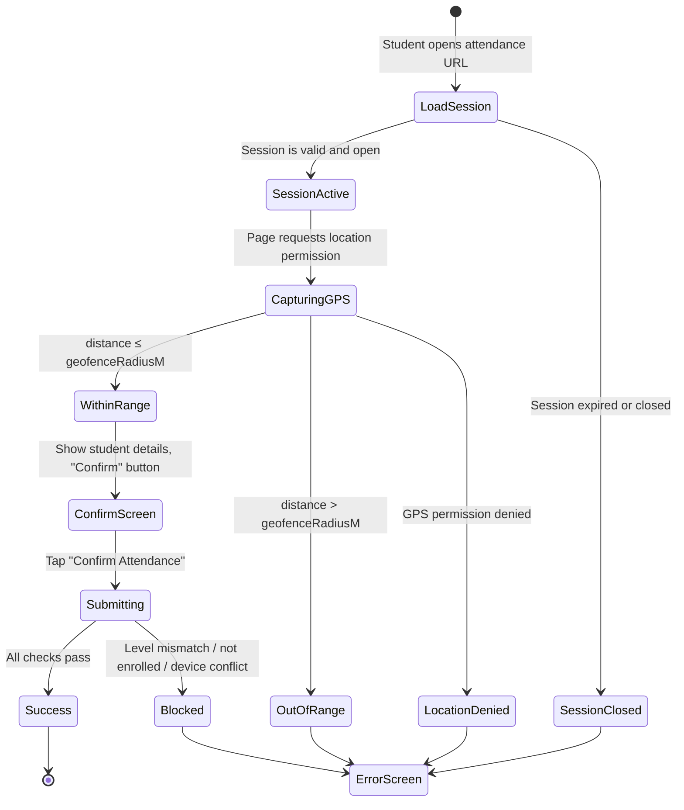

# Attendly — Product Specification

**Version:** 1.1
**Date:** March 29, 2026
**Prepared by:** Attendly Product Team

---

## 1. Purpose

This document defines **what Attendly does** at the screen and feature level — the exact behavior, flows, states, and rules that govern the product. It is the bridge between the SRS (what the system *requires*) and the implementation (what engineers *build*).

---

## 2. Information Architecture



---

## 3. Screen Specifications

### 3.1 Landing Page

| Element | Detail |
|---|---|
| Hero headline | "Attendance is as simple as a single scan" |
| Sub-headline | "Location-verified, QR-powered attendance for universities. No hardware. No roll calls. Just scan." |
| CTAs | "Get Started as Lecturer" / "Get Started as Student" |
| Features section | Feature cards: Location Smart, One-Scan Simple, Real-Time Dashboard, Zero Infrastructure |
| Footer | About, Privacy Policy, Contact |

### 3.2 Registration

**Lecturer form fields:**
- Full name (text, required)
- Email (email, required, unique across all users)
- Password (password, required, min 8 characters)
- Confirm password

**Student form fields:**
- Full name (text, required)
- Department (text, required)
- Matric number (text, required, unique among students)
- Email (email, required, must end in `@student.funaab.edu.ng`, unique across all users)
- Level (select: 100L / 200L / 300L / 400L / 500L / 600L, required)
- Gender (select: Male / Female, required)
- Password (password, required, min 8 characters)
- Confirm password

### 3.3 Lecturer Dashboard

| Component | Behavior |
|---|---|
| Course list | Cards showing course code, title, session count |
| "Create Course" button | Opens modal: course code + title fields |
| Each course card | Tappable → navigates to Course Detail |
| Empty state | "You haven't created any courses yet. Create your first course to get started." |

### 3.4 Create Session Flow

The session creation flow is a 4-step wizard:



**Step 1 — Set Time Limit:**
- Preset buttons: 15 min, 30 min, 45 min, 1 hr
- Custom input field (1–180 minutes)

**Step 2 — Capture Location:**
- Auto-triggers `navigator.geolocation.getCurrentPosition()`
- Shows spinner while acquiring GPS
- Displays acquired coordinates on success

**Step 3 — Set Geofence Radius:**
- Slider: 20–200 m (stored range: 10–500 m)
- Default: 50 m
- Label updates as slider moves

**Step 4 — Level Restriction (optional):**
- Dropdown: Any Level / 100L / 200L / 300L / 400L / 500L / 600L
- Default: Any Level (no restriction)

**Active Session Screen:**
- QR code display (large, centered)
- Attendance link
- "Share to WhatsApp" button → opens WhatsApp with QR image and link
- "Download QR" button → saves PNG to device
- Countdown timer (mm:ss)
- Live attendee list (auto-updates via SSE):
  - Columns: Name | Matric No | Department | Distance | Signed At | Method
  - Method column distinguishes "Scanned" from "Manual"
- "Mark Student Present" — search by name or matric number, select and confirm
- "End Session" button (with confirmation dialog)

### 3.5 Student Attend Flow

Students receive the attendance link via WhatsApp (or by scanning the QR with their phone camera / Google Lens). The link opens directly in the browser — no in-app QR scanner.



**Confirm Screen:**
- Course: [Code] — [Title]
- Session by: [Lecturer Name]
- Your Name: [Auto-filled from profile]
- Matric No: [Auto-filled from profile]
- Single green button: **"Confirm Attendance"**

**Success Screen:**
- "Attendance Confirmed!"
- Course name, date, and time displayed
- "Back to Dashboard" button

**Error Screen — messages by reason:**

| Reason | Message |
|---|---|
| Session closed / expired | "This session has ended. Contact your lecturer if you were present." |
| Outside geofence | "You are [X] metres from the classroom. You must be within [Y] metres to sign in." |
| Level mismatch | "This session is restricted to [X]L students." |
| Not enrolled | "Your matric number is not on the enrollment list for this course." |
| Already signed | "You have already signed attendance for this session." |
| Device already used | "This device has already been used to sign attendance for this session." |
| GPS denied | "Location access is required to verify your attendance. Please enable it and try again." |

### 3.6 Enrollment Management (Lecturer)

Accessible from the Course Detail page.

| Component | Behavior |
|---|---|
| Enrollment list table | Matric number and student name (if provided) for each enrolled student |
| Import button | Accepts JSON array of `{ matricNumber, studentName? }` entries; upserts — existing entries are not duplicated |
| Clear list button | Removes all enrollment entries for the course; sign-in becomes open to any student |
| Enrollment status indicator | Shows "Restricted" badge on course if an enrollment list is active |
| Restriction note | "When a list is active, only students whose matric number is on it can sign in." |

### 3.7 Attendance Records (Lecturer)

**Session Record View:**
- Session metadata: course, date, time, duration, level restriction, total attendees
- Table: Name | Matric No | Department | Distance | Signed At | Method (Scanned / Manual)
- Export button (CSV)

**Course Analytics View:**
- Total sessions held
- Per-student table: Name | Matric No | Department | Gender | Sessions Attended | Total Sessions | Attendance %

### 3.8 Student Attendance History

- Course list with attendance % badge
- Tap course → session list showing date and time for each session the student attended
- Overall attendance percentage displayed per course

> The history view shows sessions where the student was present. Sessions where a student was absent are not shown — lecturers see full session records including absent students via the course analytics view.

---

## 4. Feature Priority Matrix

| Feature | Status |
|---|---|
| Lecturer & student registration | Shipped |
| Student email domain enforcement (`@student.funaab.edu.ng`) | Shipped |
| Login (email or matric number) | Shipped |
| Password reset via email | Shipped |
| Course CRUD | Shipped |
| Course archiving | Shipped |
| Session creation with GPS capture | Shipped |
| Configurable geofence radius | Shipped |
| Level restriction per session | Shipped |
| QR code generation + download | Shipped |
| WhatsApp share | Shipped |
| Student attend flow (camera / Google Lens → browser) | Shipped |
| One-tap attendance confirmation | Shipped |
| Device sign-in protection (UUID + fingerprint + IP) | Shipped |
| Live attendee list (SSE) | Shipped |
| Auto-close on timer expiry | Shipped |
| Manual attendance marking | Shipped |
| Enrollment list import + enforcement | Shipped |
| Session attendance records | Shipped |
| Course analytics (per-student %) | Shipped |
| CSV export | Shipped |
| Student attendance history | Shipped |
| Password change | Shipped |
| **E2E and performance testing** | Pending |
| **Security audit** | Pending |
| Institution admin dashboard | Backlog |
| Push notifications | Backlog |
| Offline-first support | Backlog |

---

## 5. QR Code Specification

### Payload

The QR code encodes a plain HTTPS URL pointing to the student attend page:

```
https://attendly.vercel.app/attend/<sessionId>
```

The session ID is a UUID. All validation (expiry, geofence, level, enrollment, device) is performed server-side when the student submits attendance — nothing is encoded in the QR itself.

### QR Properties

| Property | Value |
|---|---|
| Error correction level | M (15% recovery) |
| Format | PNG (server-side generation via `qrcode` npm package) |
| Color | Dark foreground on white background |

---

## 6. Geolocation Specification

| Parameter | Value |
|---|---|
| API | `navigator.geolocation.getCurrentPosition()` |
| `enableHighAccuracy` | `true` |
| `timeout` | 10,000ms |
| `maximumAge` | 0 (no cache) |
| Default geofence | 50 metres |
| Geofence range | 10–500 metres (configurable per session) |
| Distance calculation | Haversine formula (server-side) |
| Fallback | Prompt user to enable GPS; no fallback to IP geolocation |

---

## 7. Notification Strategy

| Event | Channel | Recipient | Status |
|---|---|---|---|
| Password reset link | Email | User | Shipped |
| Session created | In-app | Lecturer | Shipped |
| Attendance confirmed | In-app | Student | Shipped |
| Registration confirmation | Email | User | Backlog |
| Session closing soon | In-app toast | Lecturer | Backlog |

---

## 8. Accessibility & Internationalization

| Concern | Approach |
|---|---|
| Language | English only |
| Screen reader | Semantic HTML, ARIA labels on all interactive elements |
| Color contrast | WCAG AA compliance |
| Touch targets | Minimum 44×44px for all tappable elements |
| Keyboard navigation | Full support (tab, enter, escape) |
