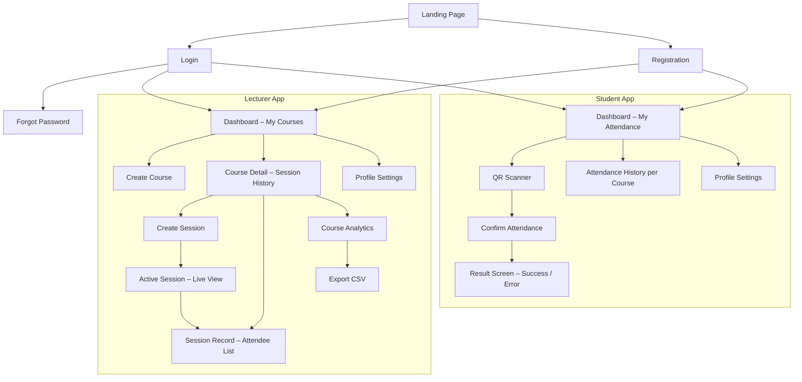
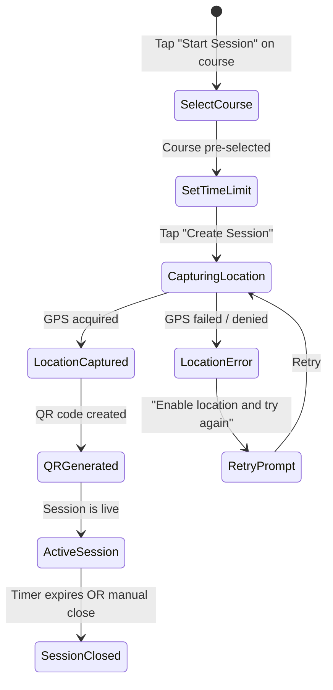
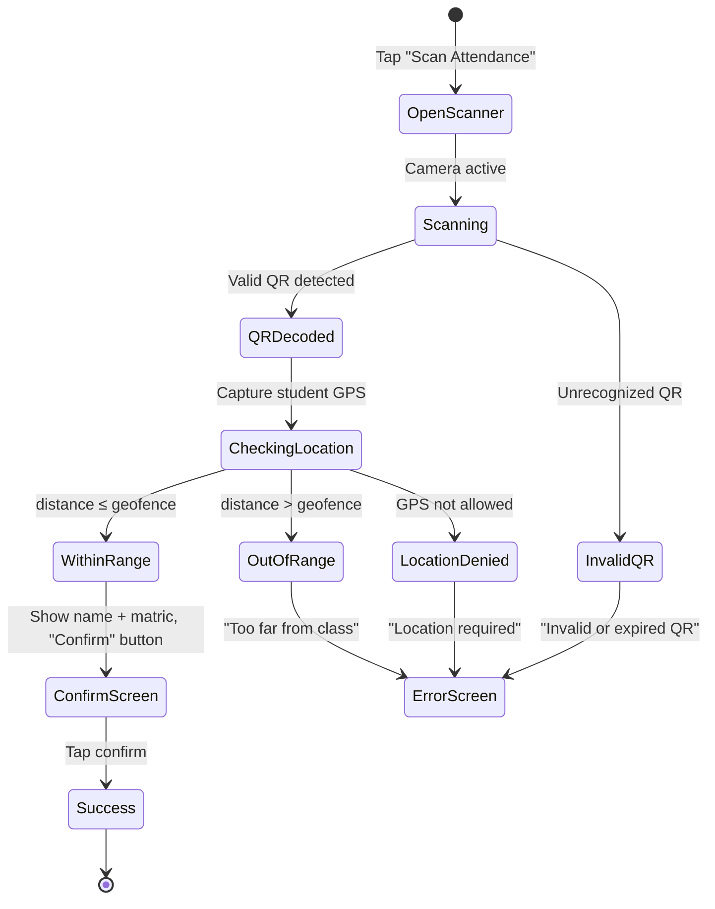

# Attendly — Product Specification

**Version:** 1.0
**Date:** March 23, 2026
**Prepared by:** Attendly Product Team

---

## 1. Purpose

This document defines **what Attendly does** at the screen and feature level — the exact behavior, flows, states, and rules that govern the product. It is the bridge between the SRS (what the system *requires*) and the implementation (what engineers *build*).

---

## 2. Information Architecture



---

## 3. Screen Specifications

### 3.1 Landing Page

| Element | Detail |
|---|---|
| Hero headline | "Attendance is as simple as a single scan" |
| Sub-headline | "Location-verified, QR-powered attendance for universities. No hardware. No roll calls. Just scan." |
| CTAs | "Get Started as Lecturer" / "Get Started as Student" |
| Features section | 3–4 feature cards (Location Smart, One-Scan Simple, Real-Time Dashboard, Zero Infrastructure) |
| Footer | About, Privacy Policy, Contact |

### 3.2 Registration

**Lecturer form fields:**
- Full name (text, required)
- Email (email, required, unique across all users)
- Password (password, required, min 8 chars, 1 uppercase, 1 number)
- Confirm password

**Student form fields:**
- Full name (text, required)
- Department (text, required)
- Matric number (text, required, unique among students)
- Email (email, required, unique across all users)
- Gender (select: Male / Female, required)
- Password (password, required, same rules)
- Confirm password

### 3.3 Lecturer Dashboard

| Component | Behavior |
|---|---|
| Course list | Cards showing course code, title, total sessions, last session date |
| "Create Course" button | Opens modal: course code + title fields |
| Each course card | Tappable → navigates to Course Detail |
| Empty state | "You haven't created any courses yet. Create your first course to get started." |

### 3.4 Create Session Flow



**Active Session Screen:**
- QR code display (large, centered)
- "Share to WhatsApp" button → opens WhatsApp with QR image
- "Download QR" button → saves PNG to device
- Countdown timer (mm:ss)
- Live attendee list below (auto-updates):
  - Columns: Name, Matric Number, Time
- "End Session" button (red, with confirmation dialog)

### 3.5 Student Scan Flow



**Confirm Screen:**
- Course: [Code] — [Title]
- Session by: [Lecturer Name]
- Your Name: [Auto-filled]
- Matric No: [Auto-filled]
- Single green button: **"Confirm Attendance"**

**Success Screen:**
- ✅ large checkmark animation
- "Attendance Confirmed!"
- Course, date, time displayed
- "Back to Dashboard" button

**Error Screen:**
- ❌ icon
- Clear error message (varies by reason)
- "Try Again" or "Back to Dashboard"

### 3.6 Attendance Records (Lecturer)

**Session Record View:**
- Session metadata: course, date, time, duration, total attendees
- Sortable table: Name | Matric No | Department | Signed At
- Export button (CSV)

**Course Analytics View:**
- Total sessions held
- Average attendance count + percentage
- Per-student table: Name | Matric No | Sessions Attended | Attendance % | Status (Good / At Risk / Critical)
  - Good: ≥ 75%, At Risk: 50–74%, Critical: < 50%

### 3.7 Student Attendance History

- Course list with attendance % badge
- Tap course → session list: Date | Status (Present ✅ / Absent ❌)
- Overall percentage prominently displayed

---

## 4. Feature Priority Matrix

| Feature | MVP (V1) | V2 | V3 |
|---|---|---|---|
| Lecturer & student registration | ✅ | | |
| Login (email + matric number) | ✅ | | |
| Password reset | ✅ | | |
| Course CRUD | ✅ | | |
| Session creation with GPS capture | ✅ | | |
| QR code generation + download | ✅ | | |
| WhatsApp share (URL scheme) | ✅ | | |
| Student QR scan + location verify | ✅ | | |
| One-tap attendance confirmation | ✅ | | |
| Live attendee list | ✅ | | |
| Auto-close on timer expiry | ✅ | | |
| Session attendance records | ✅ | | |
| CSV export | ✅ | | |
| Student attendance history | ✅ | | |
| Cumulative course analytics | | ✅ | |
| Configurable geofence radius | | ✅ | |
| Course archiving | | ✅ | |
| Late arrival tracking | | ✅ | |
| Institution admin dashboard | | | ✅ |
| SSO / university email verification | | | ✅ |
| Course enrollment enforcement | | | ✅ |
| Push notifications | | | ✅ |
| Offline-first support | | | ✅ |

---

## 5. QR Code Specification

### Payload Structure

```json
{
  "sid": "uuid-session-id",
  "exp": 1711200000,
  "loc": "encrypted-location-hash"
}
```

- **sid**: UUID of the session (lookup key)
- **exp**: Unix timestamp of session expiry (client-side pre-check)
- **loc**: Encrypted/hashed location data (server validates; not readable client-side)

### QR Properties

| Property | Value |
|---|---|
| Error correction level | M (15% recovery) |
| Size | 300×300px (display), 600×600px (download) |
| Format | PNG |
| Color | Dark foreground on white background |
| Includes | Attendly logo watermark in center (optional) |

---

## 6. Geolocation Specification

| Parameter | Value |
|---|---|
| API | `navigator.geolocation.getCurrentPosition()` |
| `enableHighAccuracy` | `true` |
| `timeout` | 10,000ms |
| `maximumAge` | 0 (no cache) |
| Default geofence | 50 meters |
| Fallback | Prompt user to enable GPS; no fallback to IP geolocation |

### Accuracy Handling

- If `accuracy > 100m`, warn user: "GPS signal is weak. Move to an open area or enable Wi-Fi."
- If `accuracy > 200m`, block sign-in: "Unable to verify your location accurately enough."

---

## 7. Notification Strategy (MVP)

| Event | Channel | Recipient |
|---|---|---|
| Registration confirmation | Email | User |
| Password reset link | Email | User |
| Session created | In-app | Lecturer |
| Attendance confirmed | In-app | Student |
| Session closing in 2 min | In-app toast | Lecturer |

---

## 8. Accessibility & Internationalization

| Concern | MVP Approach |
|---|---|
| Language | English only (V1) |
| Screen reader | Semantic HTML, ARIA labels on all interactive elements |
| Color contrast | WCAG AA compliance |
| Touch targets | Minimum 44×44px for all tappable elements |
| Keyboard navigation | Full support for web (tab, enter, escape) |
