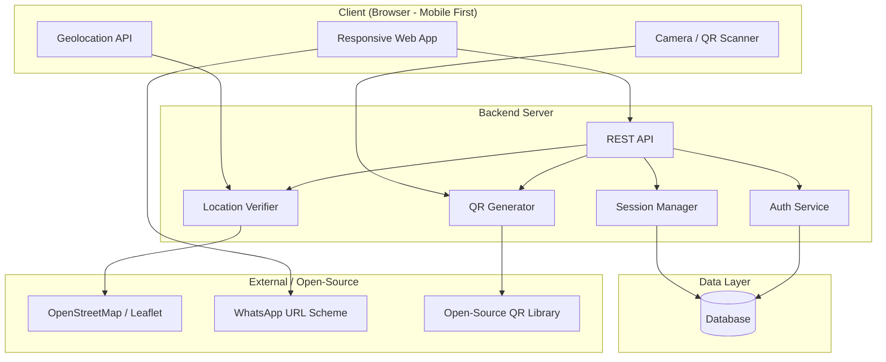

# Attendly — Software Requirement Specification (SRS)

**Version:** 1.0
**Date:** March 23, 2026
**Prepared by:** Attendly Product & Engineering Team

---

## 1. Introduction

### 1.1 Purpose

This document specifies the software requirements for **Attendly**, a location-smart, QR-based attendance system for universities. It serves as the definitive reference for design, development, testing, and stakeholder alignment.

### 1.2 Scope

Attendly is a web application (responsive, mobile-first) that enables:
- **Lecturers** to create time-bound, location-anchored attendance sessions and share QR codes
- **Students** to scan QR codes and mark attendance, verified by GPS proximity

The system does **not** include: LMS integration, biometric verification, or institutional admin panels (deferred to future versions).

### 1.3 Definitions & Acronyms

| Term | Definition |
|---|---|
| **Session** | A single, time-bound attendance event tied to a course |
| **Geofence** | A virtual geographic boundary around the lecturer's location |
| **QR Code** | Quick Response code encoding session metadata |
| **Matric Number** | Unique student identification number issued by the university |

### 1.4 References

- [Attendly Product Concept & User Stories](file:///home/abdulbasit/.gemini/antigravity/brain/52770cf5-d2dc-4e93-9395-bea950533e1b/product_concept_and_user_stories.md)

---

## 2. Overall Description

### 2.1 Product Perspective

Attendly is a standalone system. It uses open-source technologies for location sensing (Browser Geolocation API, OpenStreetMap) and QR code generation (open-source libraries). WhatsApp sharing is handled via the WhatsApp Web URL scheme (`https://wa.me/` / `whatsapp://send`) for direct image sharing.

### 2.2 User Classes

| User Class | Description | Access Level |
|---|---|---|
| **Lecturer** | University teaching staff | Create courses, manage sessions, view analytics |
| **Student** | Enrolled university students | Scan QR, sign attendance, view own history |

### 2.3 Operating Environment

- **Client:** Modern web browsers (Chrome, Safari, Firefox, Edge) on mobile and desktop
- **Server:** Linux-based cloud infrastructure
- **Location:** Browser Geolocation API (GPS + Wi-Fi assisted)

### 2.4 Constraints

- GPS accuracy indoors may vary (±10–30m); system must tolerate this with configurable geofence radius
- WhatsApp sharing is limited to URL-scheme-based sharing (no official API for direct image embedding without WhatsApp Business API)
- All location processing must use open-source tools only (no Google Maps API billing)

### 2.5 Assumptions

- Users have smartphones with GPS capability and a modern browser
- University has reasonable cellular/Wi-Fi coverage in classrooms
- Lecturers have WhatsApp groups with their students

---

## 3. Functional Requirements

### 3.1 Authentication & User Management

| ID | Requirement | Priority |
|---|---|---|
| FR-01 | System shall support user registration with role selection (Lecturer / Student) | Must |
| FR-02 | Lecturer registration: full name, email, password | Must |
| FR-03 | Student registration: full name, department, matric number, email, gender, password | Must |
| FR-04 | Email must be unique across all user types | Must |
| FR-05 | Matric number must be unique among students | Must |
| FR-06 | System shall support login via email + password | Must |
| FR-07 | System shall support student login via matric number + password | Must |
| FR-08 | System shall support password reset via email link | Must |
| FR-09 | System shall support profile editing (restricted fields: matric number locked after registration) | Must |
| FR-10 | System shall use JWT-based authentication with token refresh | Must |

### 3.2 Course Management

| ID | Requirement | Priority |
|---|---|---|
| FR-11 | Lecturers shall create courses with a course code and title | Must |
| FR-12 | Course code must be unique per lecturer | Must |
| FR-13 | Lecturers shall view, edit, and archive their courses | Must |
| FR-14 | Archived courses are hidden from active list; data is preserved | Should |

### 3.3 Attendance Session Management

| ID | Requirement | Priority |
|---|---|---|
| FR-15 | Lecturers shall create an attendance session by selecting a course and setting a time limit (in minutes) | Must |
| FR-16 | System shall capture the lecturer's GPS coordinates at session creation | Must |
| FR-17 | System shall generate a unique, session-bound QR code | Must |
| FR-18 | QR code shall encode: session ID, location hash, expiry timestamp | Must |
| FR-19 | QR code shall be downloadable as PNG image | Must |
| FR-20 | QR code shall be shareable via WhatsApp URL scheme (opens WhatsApp with pre-attached image/link) | Must |
| FR-21 | System shall display a live, auto-updating list of signed-in students during an active session | Must |
| FR-22 | Lecturers shall be able to manually close a session before the timer expires | Should |
| FR-23 | System shall auto-close the session when the time limit is reached | Must |
| FR-24 | System shall reject sign-in attempts after session closure with a clear message | Must |

### 3.4 Attendance Sign-In (Student)

| ID | Requirement | Priority |
|---|---|---|
| FR-25 | Students shall scan a QR code using the in-app scanner or device camera | Must |
| FR-26 | System shall capture the student's GPS coordinates upon scan | Must |
| FR-27 | System shall compare student's location against the session's geofence | Must |
| FR-28 | Default geofence radius: 50 meters; configurable by lecturer (30–100m) | Must |
| FR-29 | If within geofence and session active → auto-fill student name + matric number and present a single "Confirm Attendance" button | Must |
| FR-30 | If outside geofence → reject with message: "You are too far from the class location" | Must |
| FR-31 | If session expired → reject with message: "This session has ended" | Must |
| FR-32 | System shall prevent duplicate sign-in for the same session | Must |
| FR-33 | System shall display a confirmation screen upon successful sign-in | Must |

### 3.5 Attendance Records & Analytics

| ID | Requirement | Priority |
|---|---|---|
| FR-34 | Lecturers shall view attendance records per session (name, matric, department, timestamp) | Must |
| FR-35 | Lecturers shall view cumulative statistics per course (total sessions, avg. turnout, per-student %) | Should |
| FR-36 | Lecturers shall export attendance data as CSV | Must |
| FR-37 | Students shall view their own attendance history per course | Should |
| FR-38 | Students shall see their attendance percentage per course | Should |

---

## 4. Non-Functional Requirements

| ID | Category | Requirement |
|---|---|---|
| NFR-01 | **Performance** | QR code generation shall complete in < 1 second |
| NFR-02 | **Performance** | Attendance sign-in (scan → confirmation) shall complete in < 3 seconds |
| NFR-03 | **Performance** | Live attendee list shall update within 2 seconds of a new sign-in |
| NFR-04 | **Security** | All API communication over HTTPS (TLS 1.2+) |
| NFR-05 | **Security** | Passwords stored using bcrypt with salt rounds ≥ 10 |
| NFR-06 | **Security** | JWT tokens expire after 24 hours; refresh tokens after 7 days |
| NFR-07 | **Security** | Location data is never stored in raw form on the client; only transmitted to the server for verification |
| NFR-08 | **Usability** | Student sign-in flow shall require ≤ 2 taps after scanning the QR code |
| NFR-09 | **Usability** | Mobile-first responsive design; fully functional on screens ≥ 320px wide |
| NFR-10 | **Reliability** | System shall have 99.5% uptime during university operating hours (8 AM – 8 PM) |
| NFR-11 | **Scalability** | System shall support at least 500 concurrent sign-ins per session without degradation |
| NFR-12 | **Compatibility** | Shall work on Chrome 90+, Safari 14+, Firefox 88+, Edge 90+ |

---

## 5. System Architecture Overview



---

## 6. Data Models

### 6.1 User

| Field | Type | Constraints |
|---|---|---|
| id | UUID | Primary key |
| role | ENUM('lecturer', 'student') | Required |
| full_name | VARCHAR(255) | Required |
| email | VARCHAR(255) | Unique, required |
| password_hash | VARCHAR(255) | Required |
| department | VARCHAR(255) | Required if student |
| matric_number | VARCHAR(50) | Unique among students, required if student |
| gender | ENUM('male', 'female', 'other') | Required if student |
| created_at | TIMESTAMP | Auto |
| updated_at | TIMESTAMP | Auto |

### 6.2 Course

| Field | Type | Constraints |
|---|---|---|
| id | UUID | Primary key |
| lecturer_id | UUID | Foreign key → User |
| course_code | VARCHAR(20) | Unique per lecturer |
| course_title | VARCHAR(255) | Required |
| is_archived | BOOLEAN | Default: false |
| created_at | TIMESTAMP | Auto |

### 6.3 Session

| Field | Type | Constraints |
|---|---|---|
| id | UUID | Primary key |
| course_id | UUID | Foreign key → Course |
| lecturer_id | UUID | Foreign key → User |
| latitude | DECIMAL(10,7) | Required |
| longitude | DECIMAL(10,7) | Required |
| geofence_radius_m | INTEGER | Default: 50 |
| time_limit_minutes | INTEGER | Required |
| qr_code_data | TEXT | Unique encoded payload |
| status | ENUM('active', 'closed') | Default: active |
| created_at | TIMESTAMP | Auto |
| expires_at | TIMESTAMP | Computed: created_at + time_limit |

### 6.4 Attendance

| Field | Type | Constraints |
|---|---|---|
| id | UUID | Primary key |
| session_id | UUID | Foreign key → Session |
| student_id | UUID | Foreign key → User |
| latitude | DECIMAL(10,7) | Student's location at sign-in |
| longitude | DECIMAL(10,7) | Student's location at sign-in |
| distance_m | DECIMAL(8,2) | Computed distance from lecturer |
| signed_at | TIMESTAMP | Auto |
| UNIQUE | (session_id, student_id) | Prevents duplicate sign-in |

---

## 7. API Endpoints (Summary)

### Authentication
| Method | Endpoint | Description |
|---|---|---|
| POST | `/api/auth/register` | Register new user (lecturer or student) |
| POST | `/api/auth/login` | Login (email or matric number) |
| POST | `/api/auth/forgot-password` | Request password reset |
| POST | `/api/auth/reset-password` | Reset password with token |

### Courses
| Method | Endpoint | Description |
|---|---|---|
| POST | `/api/courses` | Create a course |
| GET | `/api/courses` | List lecturer's courses |
| PUT | `/api/courses/:id` | Update a course |
| PATCH | `/api/courses/:id/archive` | Archive a course |

### Sessions
| Method | Endpoint | Description |
|---|---|---|
| POST | `/api/sessions` | Create attendance session (captures location) |
| GET | `/api/sessions/:id` | Get session details + QR code |
| PATCH | `/api/sessions/:id/close` | Manually close session |
| GET | `/api/sessions/:id/attendees` | Live attendee list |

### Attendance
| Method | Endpoint | Description |
|---|---|---|
| POST | `/api/attendance/:sessionId` | Sign attendance (sends student location) |
| GET | `/api/attendance/history` | Student's attendance history |
| GET | `/api/attendance/course/:courseId` | Course attendance records (lecturer) |
| GET | `/api/attendance/course/:courseId/export` | Export as CSV |

---

## 8. External Interface Requirements

| Interface | Technology | License | Purpose |
|---|---|---|---|
| Geolocation | Browser Geolocation API | Built-in | Capture GPS coordinates |
| Map Display | Leaflet.js + OpenStreetMap | BSD-2 / ODbL | Optional map view for location verification |
| QR Generation | `qrcode` (npm) or `python-qrcode` | MIT | Generate QR code images |
| QR Scanning | `html5-qrcode` (npm) | Apache 2.0 | In-browser QR scanner |
| WhatsApp Share | WhatsApp URL scheme (`https://api.whatsapp.com/send`) | N/A | Direct share of QR image/link |
| Email | Nodemailer + SMTP / Resend | MIT | Password reset emails |

---

## 9. Appendix

### 9.1 Geofence Distance Calculation

The system uses the **Haversine formula** to calculate the great-circle distance between two GPS points:

```
a = sin²(Δlat/2) + cos(lat1) · cos(lat2) · sin²(Δlon/2)
c = 2 · atan2(√a, √(1−a))
d = R · c   (where R = 6,371,000 meters)
```

If `d ≤ geofence_radius_m`, the student is within range.
