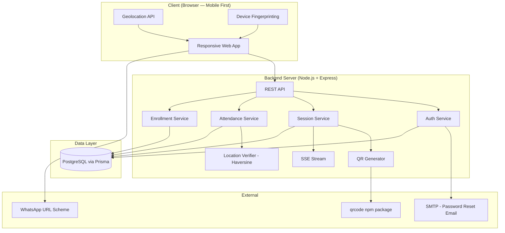

# Attendly — Software Requirement Specification (SRS)

**Version:** 1.1
**Date:** March 29, 2026
**Prepared by:** Attendly Product & Engineering Team

---

## 1. Introduction

### 1.1 Purpose

This document specifies the software requirements for **Attendly**, a location-smart, QR-based attendance system for universities. It serves as the definitive reference for design, development, testing, and stakeholder alignment.

### 1.2 Scope

Attendly is a web application (responsive, mobile-first) that enables:
- **Lecturers** to create time-bound, location-anchored attendance sessions and share QR codes
- **Students** to open attendance links and mark attendance, verified by GPS proximity

The system does **not** include: LMS integration, biometric verification, or institutional admin panels (deferred to future versions).

### 1.3 Definitions & Acronyms

| Term | Definition |
|---|---|
| **Session** | A single, time-bound attendance event tied to a course |
| **Geofence** | A virtual geographic boundary around the lecturer's GPS location |
| **QR Code** | Quick Response code encoding the session's attendance URL |
| **Matric Number** | Unique student identification number issued by the university |
| **Device UUID** | A persistent identifier generated on first browser visit and stored in `localStorage` |
| **Browser Fingerprint** | An FNV-1a hash of hardware and browser signals (user agent, screen dimensions, timezone, hardware concurrency, platform) used to identify a device even across incognito mode |
| **Enrollment List** | A per-course list of matric numbers; when active, restricts attendance sign-in to listed students only |
| **Level Restriction** | A per-session rule that blocks students whose academic level does not match the specified level |
| **SSE** | Server-Sent Events — a persistent HTTP connection used to push real-time updates from server to client |

### 1.4 References

- [Product Concept & User Stories](product_concept_and_user_stories.md)
- [Product Specification](product_specification.md)
- [Technical Architecture](technical_architecture.md)

---

## 2. Overall Description

### 2.1 Product Perspective

Attendly is a standalone system. It uses open-source technologies for location sensing (Browser Geolocation API), QR code generation (`qrcode` npm package), and real-time updates (Server-Sent Events). WhatsApp sharing is handled via the WhatsApp Web URL scheme for direct link/image sharing.

### 2.2 User Classes

| User Class | Description | Access Level |
|---|---|---|
| **Lecturer** | University teaching staff | Create courses, manage enrollment lists, manage sessions, view and export analytics |
| **Student** | Enrolled university students | Sign attendance, view own history |

### 2.3 Operating Environment

- **Client:** Modern web browsers (Chrome, Safari, Firefox, Edge) on mobile and desktop
- **Server:** Linux-based cloud infrastructure (Node.js + Express.js)
- **Database:** PostgreSQL via Prisma ORM
- **Location:** Browser Geolocation API (GPS + Wi-Fi assisted)

### 2.4 Constraints

- GPS accuracy indoors may vary (±10–30 m); system must tolerate this with a configurable geofence radius
- WhatsApp sharing is limited to URL-scheme-based sharing (no official API for direct image embedding without WhatsApp Business API)
- All location processing must use open-source tools only (no Google Maps API billing)

### 2.5 Assumptions

- Users have smartphones with GPS capability and a modern browser
- University has reasonable cellular/Wi-Fi coverage in classrooms
- Lecturers have WhatsApp groups with their students
- Students have a `@student.funaab.edu.ng` university email address

---

## 3. Functional Requirements

### 3.1 Authentication & User Management

| ID | Requirement | Priority |
|---|---|---|
| FR-01 | System shall support user registration with role selection (Lecturer / Student) | Must |
| FR-02 | Lecturer registration: full name, email, password (min 8 chars) | Must |
| FR-03 | Student registration: full name, department, matric number, email, level, gender, password | Must |
| FR-04 | Student email must end in `@student.funaab.edu.ng` | Must |
| FR-05 | Email must be unique across all user types | Must |
| FR-06 | Matric number must be unique among students | Must |
| FR-07 | System shall support login via email + password | Must |
| FR-08 | System shall support student login via matric number + password | Must |
| FR-09 | System shall support password reset via email link (token expires in 1 hour, single-use) | Must |
| FR-10 | System shall support authenticated password change (requires current password) | Must |
| FR-11 | System shall support profile editing; matric number and email are locked after registration | Must |
| FR-12 | System shall use JWT-based authentication with 24-hour access tokens and 7-day refresh tokens | Must |

### 3.2 Course Management

| ID | Requirement | Priority |
|---|---|---|
| FR-13 | Lecturers shall create courses with a course code and title | Must |
| FR-14 | Course code must be unique per lecturer | Must |
| FR-15 | Lecturers shall view, edit, and archive their courses | Must |
| FR-16 | Archived courses are hidden from active list; data is preserved | Must |
| FR-17 | Lecturers shall import an enrollment list of matric numbers per course (upsert — no duplicates) | Must |
| FR-18 | Lecturers shall view the current enrollment list for a course | Must |
| FR-19 | Lecturers shall clear the enrollment list for a course, lifting the sign-in restriction | Must |

### 3.3 Attendance Session Management

| ID | Requirement | Priority |
|---|---|---|
| FR-20 | Lecturers shall create an attendance session by selecting a course and setting a time limit (1–180 minutes) | Must |
| FR-21 | System shall capture the lecturer's GPS coordinates at session creation | Must |
| FR-22 | Lecturers shall set a geofence radius per session (default: 50 m, range: 10–500 m) | Must |
| FR-23 | Lecturers shall optionally restrict a session to a specific student level (100L–600L) | Must |
| FR-24 | System shall generate a unique, session-bound QR code encoding the attendance URL | Must |
| FR-25 | QR code shall be downloadable as PNG | Must |
| FR-26 | QR code shall be shareable via WhatsApp URL scheme | Must |
| FR-27 | System shall provide a Server-Sent Events stream for real-time attendee updates during a session | Must |
| FR-28 | Lecturers shall be able to manually close a session before the timer expires | Must |
| FR-29 | System shall auto-close the session when the time limit is reached | Must |
| FR-30 | System shall reject sign-in attempts after session closure with a clear message | Must |

### 3.4 Attendance Sign-In (Student)

| ID | Requirement | Priority |
|---|---|---|
| FR-31 | Students shall sign in by opening the attendance URL in their mobile browser (via camera / Google Lens QR scan or shared link) — no in-app scanner required | Must |
| FR-32 | System shall capture the student's GPS coordinates upon page load | Must |
| FR-33 | System shall calculate the distance between the student and the session location using the Haversine formula | Must |
| FR-34 | If student is within the geofence and session is active: auto-fill name and matric number and present a single "Confirm Attendance" button | Must |
| FR-35 | If student is outside the geofence: reject with message showing their distance and the required radius | Must |
| FR-36 | If session has a level restriction and student's level does not match: reject with a level mismatch message | Must |
| FR-37 | If course has an active enrollment list and student's matric number is not on it: reject with enrollment message | Must |
| FR-38 | System shall prevent duplicate sign-in by the same student for the same session | Must |
| FR-39 | System shall record the signing device's UUID; reject if the same device UUID has already been used in this session | Must |
| FR-40 | System shall record a browser fingerprint hash; reject if the same fingerprint has already been used in this session | Must |
| FR-41 | System shall record the client IP address; reject if the same IP has already been used in this session | Must |
| FR-42 | System shall display a confirmation screen upon successful sign-in | Must |

### 3.5 Manual Attendance Marking (Lecturer)

| ID | Requirement | Priority |
|---|---|---|
| FR-43 | Lecturers shall search registered students by name or matric number from the active session page | Must |
| FR-44 | Lecturers shall mark any registered student as present for an active session | Must |
| FR-45 | Manually marked records shall be flagged as `markedManually: true` in the attendance record | Must |
| FR-46 | Manual marking shall bypass geofence and device checks | Must |

### 3.6 Attendance Records & Analytics

| ID | Requirement | Priority |
|---|---|---|
| FR-47 | Lecturers shall view per-session attendance lists (name, matric number, department, distance, sign-in time, method) | Must |
| FR-48 | Lecturers shall view per-student cumulative attendance stats per course (sessions attended, total, percentage) | Must |
| FR-49 | Lecturers shall export course attendance data as CSV | Must |
| FR-50 | Students shall view their own attendance history per course | Must |
| FR-51 | Students shall see their attendance percentage per course | Must |

---

## 4. Non-Functional Requirements

| ID | Category | Requirement |
|---|---|---|
| NFR-01 | **Performance** | QR code generation shall complete in < 1 second |
| NFR-02 | **Performance** | Attendance sign-in (submit → confirmation) shall complete in < 3 seconds |
| NFR-03 | **Performance** | Live attendee list shall update within 2 seconds of a new sign-in via SSE |
| NFR-04 | **Security** | All API communication over HTTPS (TLS 1.2+) |
| NFR-05 | **Security** | Passwords stored using bcrypt with salt rounds ≥ 10 |
| NFR-06 | **Security** | JWT access tokens expire after 24 hours; refresh tokens after 7 days |
| NFR-07 | **Security** | Auth endpoints rate-limited to 5 requests per minute per IP |
| NFR-08 | **Security** | Student location coordinates are transmitted to the server and stored per attendance record; never exposed to other clients |
| NFR-09 | **Usability** | Student sign-in flow shall require ≤ 2 taps after opening the attendance URL |
| NFR-10 | **Usability** | Mobile-first responsive design; fully functional on screens ≥ 320px wide |
| NFR-11 | **Reliability** | System shall have 99.5% uptime during university operating hours (8 AM – 8 PM) |
| NFR-12 | **Scalability** | System shall support at least 500 concurrent sign-ins per session without degradation |
| NFR-13 | **Compatibility** | Shall work on Chrome 90+, Safari 14+, Firefox 88+, Edge 90+ |

---

## 5. System Architecture Overview



---

## 6. Data Models

### 6.1 User

| Field | Type | Constraints |
|---|---|---|
| id | UUID | Primary key |
| role | ENUM(LECTURER, STUDENT) | Required |
| fullName | VARCHAR(255) | Required |
| email | VARCHAR(255) | Unique, required |
| passwordHash | VARCHAR(255) | Required |
| department | VARCHAR(255) | Required if STUDENT |
| matricNumber | VARCHAR(50) | Unique among students, required if STUDENT |
| gender | ENUM(MALE, FEMALE) | Required if STUDENT |
| level | INTEGER | Required if STUDENT (100–900) |
| createdAt | TIMESTAMP | Auto |
| updatedAt | TIMESTAMP | Auto |

### 6.2 Course

| Field | Type | Constraints |
|---|---|---|
| id | UUID | Primary key |
| lecturerId | UUID | Foreign key → User |
| courseCode | VARCHAR(20) | Unique per lecturer |
| courseTitle | VARCHAR(255) | Required |
| isArchived | BOOLEAN | Default: false |
| createdAt | TIMESTAMP | Auto |
| updatedAt | TIMESTAMP | Auto |

### 6.3 CourseEnrollment

| Field | Type | Constraints |
|---|---|---|
| id | UUID | Primary key |
| courseId | UUID | Foreign key → Course |
| matricNumber | VARCHAR(50) | Required |
| studentName | VARCHAR(255) | Optional |
| createdAt | TIMESTAMP | Auto |
| UNIQUE | (courseId, matricNumber) | Prevents duplicate entries |

> When any enrollment rows exist for a course, sign-in is restricted to matric numbers in this table.

### 6.4 Session

| Field | Type | Constraints |
|---|---|---|
| id | UUID | Primary key |
| courseId | UUID | Foreign key → Course |
| lecturerId | UUID | Foreign key → User |
| latitude | DECIMAL(10,7) | Required — lecturer's location |
| longitude | DECIMAL(10,7) | Required — lecturer's location |
| geofenceRadiusM | INTEGER | Default: 50, range: 10–500 |
| timeLimitMinutes | INTEGER | Required, range: 1–180 |
| level | INTEGER | Optional — restricts sign-in by student level |
| qrPayload | VARCHAR | Unique — encodes the attendance URL |
| status | ENUM(ACTIVE, CLOSED) | Default: ACTIVE |
| createdAt | TIMESTAMP | Auto |
| expiresAt | TIMESTAMP | Computed: createdAt + timeLimitMinutes |
| closedAt | TIMESTAMP | Set when manually or auto-closed |

### 6.5 Attendance

| Field | Type | Constraints |
|---|---|---|
| id | UUID | Primary key |
| sessionId | UUID | Foreign key → Session |
| studentId | UUID | Foreign key → User |
| deviceId | VARCHAR | Optional — browser UUID from localStorage |
| fingerprint | VARCHAR | Optional — FNV-1a browser fingerprint hash |
| ipAddress | VARCHAR | Optional — client IP address |
| markedManually | BOOLEAN | Default: false |
| latitude | DECIMAL(10,7) | Student's GPS at sign-in |
| longitude | DECIMAL(10,7) | Student's GPS at sign-in |
| distanceM | DECIMAL(8,2) | Computed Haversine distance from session location |
| signedAt | TIMESTAMP | Auto |
| UNIQUE | (sessionId, studentId) | Prevents duplicate student sign-in |
| UNIQUE | (sessionId, deviceId) | Prevents same device being used twice |
| UNIQUE | (sessionId, fingerprint) | Prevents fingerprint reuse across incognito |

### 6.6 PasswordResetToken

| Field | Type | Constraints |
|---|---|---|
| id | UUID | Primary key |
| userId | UUID | Foreign key → User |
| token | VARCHAR | Unique — 32-byte hex string |
| expiresAt | TIMESTAMP | 1 hour from creation |
| usedAt | TIMESTAMP | Null until redeemed |
| createdAt | TIMESTAMP | Auto |

---

## 7. API Endpoints (Summary)

### Authentication — `/api/auth`

| Method | Endpoint | Auth | Description |
|---|---|---|---|
| POST | `/api/auth/register` | — | Register new user |
| POST | `/api/auth/login` | — | Login (email or matric number) |
| POST | `/api/auth/refresh` | — | Exchange refresh token for new access token |
| POST | `/api/auth/forgot-password` | — | Request password reset email |
| POST | `/api/auth/reset-password` | — | Reset password with token |
| GET | `/api/auth/me` | JWT | Get current user profile |
| PUT | `/api/auth/profile` | JWT | Update profile fields |
| POST | `/api/auth/change-password` | JWT | Change password |

### Courses — `/api/courses`

| Method | Endpoint | Auth | Description |
|---|---|---|---|
| POST | `/api/courses` | LECTURER | Create a course |
| GET | `/api/courses` | LECTURER | List all courses |
| GET | `/api/courses/:id` | LECTURER | Get course with session list |
| PUT | `/api/courses/:id` | LECTURER | Update course code or title |
| PATCH | `/api/courses/:id/archive` | LECTURER | Toggle archived status |
| GET | `/api/courses/:id/enrollment` | LECTURER | Get enrollment list |
| POST | `/api/courses/:id/enrollment` | LECTURER | Import (upsert) enrollment list |
| DELETE | `/api/courses/:id/enrollment` | LECTURER | Clear enrollment list |

### Sessions — `/api/sessions`

| Method | Endpoint | Auth | Description |
|---|---|---|---|
| POST | `/api/sessions` | LECTURER | Create session (captures GPS, generates QR) |
| GET | `/api/sessions/:id` | LECTURER | Get session details + attendee list + QR |
| PATCH | `/api/sessions/:id/close` | LECTURER | Manually close session |
| DELETE | `/api/sessions/:id` | LECTURER | Delete session |
| GET | `/api/sessions/:id/stream` | LECTURER* | SSE stream for live attendee updates |
| GET | `/api/sessions/:id/info` | JWT | Public session info for student attend page |

> *SSE does not support custom headers — pass the token as `?token=<accessToken>` query parameter.

### Attendance — `/api/attendance`

| Method | Endpoint | Auth | Description |
|---|---|---|---|
| POST | `/api/attendance` | STUDENT | Sign attendance (validates GPS, device, level, enrollment) |
| POST | `/api/attendance/sessions/:sessionId/manual` | LECTURER | Manually mark a student present |
| GET | `/api/attendance/history` | STUDENT | Student's attendance history |
| GET | `/api/attendance/course/:courseId` | LECTURER | Per-student stats for a course |
| GET | `/api/attendance/course/:courseId/export` | LECTURER | Download CSV |

### Users — `/api/users`

| Method | Endpoint | Auth | Description |
|---|---|---|---|
| GET | `/api/users/search` | LECTURER | Search students by name or matric number |

---

## 8. External Interface Requirements

| Interface | Technology | License | Purpose |
|---|---|---|---|
| Geolocation | Browser Geolocation API | Built-in | Capture GPS coordinates |
| QR Generation | `qrcode` (npm) | MIT | Generate QR PNG images server-side |
| WhatsApp Share | WhatsApp URL scheme | N/A | Share attendance link / QR to class group |
| Email | Nodemailer + SMTP | MIT | Password reset emails |
| Real-time | Server-Sent Events (native Node.js) | Built-in | Push live attendee updates to lecturer |

---

## 9. Appendix

### 9.1 Geofence Distance Calculation

The system uses the **Haversine formula** to calculate the great-circle distance between two GPS points:

```
a = sin²(Δlat/2) + cos(lat1) · cos(lat2) · sin²(Δlon/2)
c = 2 · atan2(√a, √(1−a))
d = R · c   (where R = 6,371,000 meters)
```

If `d ≤ geofenceRadiusM`, the student is within range.

### 9.2 Device Sign-in Protection

Three independent signals are captured per attendance record and enforced as unique constraints per session:

| Signal | Source | Survives |
|---|---|---|
| **Device UUID** | Generated on first visit, stored in `localStorage` | Normal browser sessions |
| **Browser fingerprint** | FNV-1a hash of: user agent, screen resolution, timezone, hardware concurrency, platform | Incognito mode, cleared localStorage |
| **IP address** | Server-captured client IP | All client-side bypasses |

All three are optional on the API. If omitted, only the per-student uniqueness constraint applies.

### 9.3 Attendance Validation Order

Sign-in attempts are validated in this sequence (first failure is returned to the client):

1. Session exists and is ACTIVE
2. Session has not passed `expiresAt`
3. Student's `level` matches session's `level` restriction (if set)
4. Student's `matricNumber` is in the course enrollment list (if list is active)
5. Student's GPS distance ≤ `geofenceRadiusM`
6. Student has not already signed for this session
7. Device UUID has not already been used in this session (if provided)
8. Browser fingerprint has not already been used in this session (if provided)
9. IP address has not already been used in this session (if provided)
