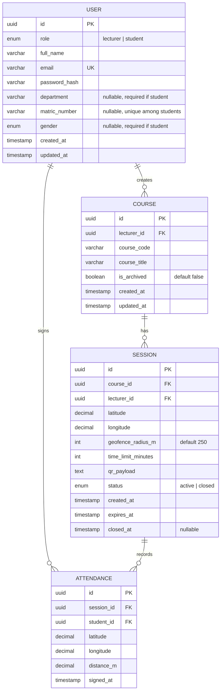
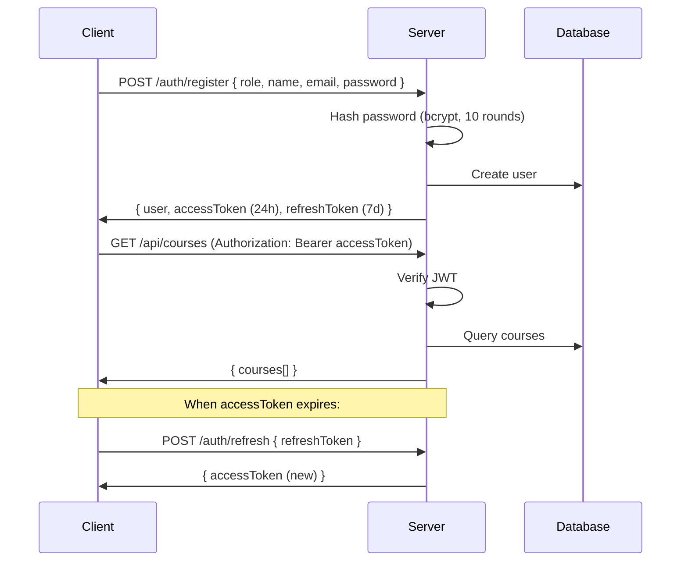
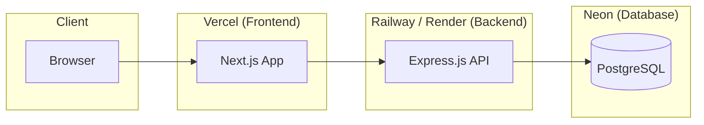

# Attendly — Technical Architecture & Implementation Plan

**Version:** 1.0
**Date:** March 23, 2026

---

## 1. Tech Stack

| Layer | Technology | Rationale |
|---|---|---|
| **Frontend** | Next.js 14 (App Router) | SSR/SSG for landing page SEO, React for interactive dashboards, built-in API routes option |
| **Styling** | Vanilla CSS (custom properties) | Full control, no dependencies, design tokens map directly |
| **Icons** | Lucide React | Clean line icons, open-source, tree-shakeable |
| **Backend** | Node.js + Express.js | Lightweight, fast, large ecosystem, same language as frontend |
| **Database** | PostgreSQL | Relational integrity for attendance data, robust JOIN support, open-source |
| **ORM** | Prisma | Type-safe queries, auto-migrations, schema-first design |
| **Auth** | JWT (access + refresh tokens) | Stateless, scalable, no session store needed |
| **Password hashing** | bcrypt | Industry standard, configurable salt rounds |
| **QR Generation** | `qrcode` (npm) | MIT license, fast PNG generation, server-side |
| **QR Scanning** | External (Google Lens, phone camera) | No library needed — QR encodes a URL that redirects to the app |
| **Geolocation** | Browser Geolocation API | Built-in, GPS + Wi-Fi assisted, no paid API |
| **Real-time** | Server-Sent Events (SSE) | Simpler than WebSockets for one-way updates (live attendee list) |
| **Email** | Nodemailer + SMTP (or Resend) | Password resets, transactional emails |
| **Hosting** | Vercel (frontend) + Railway/Render (backend) | Free/low-cost tiers, auto-deploy from Git |
| **Database hosting** | Neon or Supabase (PostgreSQL) | Free tier, managed, serverless-friendly |

---

## 2. Project Structure

```
Attendly/
  client/                    # Next.js frontend
    app/
      (public)/              # Landing, login, register
        page.jsx
        login/page.jsx
        register/page.jsx
      (dashboard)/           # Authenticated routes
        layout.jsx           # Sidebar + auth guard
        lecturer/
          dashboard/page.jsx
          courses/[id]/page.jsx
          sessions/[id]/page.jsx
          analytics/[courseId]/page.jsx
          profile/page.jsx
        student/
          dashboard/page.jsx
          history/page.jsx
          profile/page.jsx
      attend/
        [sessionId]/page.jsx  # Public page — QR redirects here
    components/
      ui/                    # Button, Input, Card, Modal, Badge
      layout/                # Sidebar, Navbar, PageHeader
      features/              # QRScanner, QRDisplay, AttendeeList, CountdownTimer
    lib/
      api.js                 # API client (fetch wrapper)
      auth.js                # Token management
      geo.js                 # Geolocation helpers
    styles/
      globals.css            # Design tokens, reset, utilities
      components.css         # Component styles
    public/

  server/                    # Express.js backend
    src/
      index.js               # Entry point
      config/
        db.js                # Prisma client
        env.js               # Environment config
      middleware/
        auth.js              # JWT verification
        validate.js          # Request validation
        errorHandler.js
      routes/
        auth.routes.js
        course.routes.js
        session.routes.js
        attendance.routes.js
      controllers/
        auth.controller.js
        course.controller.js
        session.controller.js
        attendance.controller.js
      services/
        auth.service.js
        course.service.js
        session.service.js
        attendance.service.js
        qr.service.js
        geo.service.js
        email.service.js
      utils/
        haversine.js         # Distance calculation
        qrGenerator.js       # QR code image generation
        tokens.js            # JWT sign/verify
    prisma/
      schema.prisma
      migrations/

  docs/                      # Product documentation
  README.md
```

---

## 3. Database Schema (ERD)



### Prisma Schema (Key Models)

```prisma
model User {
  id           String   @id @default(uuid())
  role         Role
  fullName     String
  email        String   @unique
  passwordHash String
  department   String?
  matricNumber String?  @unique
  gender       Gender?
  createdAt    DateTime @default(now())
  updatedAt    DateTime @updatedAt

  courses      Course[]
  attendances  Attendance[]
  sessions     Session[]
}

model Course {
  id          String   @id @default(uuid())
  lecturerId  String
  courseCode   String
  courseTitle  String
  isArchived  Boolean  @default(false)
  createdAt   DateTime @default(now())
  updatedAt   DateTime @updatedAt

  lecturer    User      @relation(fields: [lecturerId], references: [id])
  sessions    Session[]

  @@unique([lecturerId, courseCode])
}

model Session {
  id               String   @id @default(uuid())
  courseId          String
  lecturerId       String
  latitude         Decimal  @db.Decimal(10, 7)
  longitude        Decimal  @db.Decimal(10, 7)
  geofenceRadiusM  Int      @default(250)
  timeLimitMinutes Int
  qrPayload        String   @unique
  status           SessionStatus @default(ACTIVE)
  createdAt        DateTime @default(now())
  expiresAt        DateTime
  closedAt         DateTime?

  course           Course      @relation(fields: [courseId], references: [id])
  lecturer         User        @relation(fields: [lecturerId], references: [id])
  attendances      Attendance[]
}

model Attendance {
  id        String   @id @default(uuid())
  sessionId String
  studentId String
  latitude  Decimal  @db.Decimal(10, 7)
  longitude Decimal  @db.Decimal(10, 7)
  distanceM Decimal  @db.Decimal(8, 2)
  signedAt  DateTime @default(now())

  session   Session @relation(fields: [sessionId], references: [id])
  student   User    @relation(fields: [studentId], references: [id])

  @@unique([sessionId, studentId])
}

enum Role {
  LECTURER
  STUDENT
}

enum Gender {
  MALE
  FEMALE
}

enum SessionStatus {
  ACTIVE
  CLOSED
}
```

---

## 4. API Contract

### Authentication

| Method | Endpoint | Body | Response | Auth |
|---|---|---|---|---|
| POST | `/api/auth/register` | `{ role, fullName, email, password, department?, matricNumber?, gender? }` | `{ user, accessToken, refreshToken }` | No |
| POST | `/api/auth/login` | `{ identifier, password }` (identifier = email or matric) | `{ user, accessToken, refreshToken }` | No |
| POST | `/api/auth/refresh` | `{ refreshToken }` | `{ accessToken }` | No |
| POST | `/api/auth/forgot-password` | `{ email }` | `{ message }` | No |
| POST | `/api/auth/reset-password` | `{ token, newPassword }` | `{ message }` | No |
| GET | `/api/auth/me` | — | `{ user }` | Yes |
| PUT | `/api/auth/profile` | `{ fullName?, department?, gender? }` | `{ user }` | Yes |

### Courses (Lecturer only)

| Method | Endpoint | Body | Response | Auth |
|---|---|---|---|---|
| POST | `/api/courses` | `{ courseCode, courseTitle }` | `{ course }` | Lecturer |
| GET | `/api/courses` | — | `{ courses[] }` | Lecturer |
| GET | `/api/courses/:id` | — | `{ course, sessions[] }` | Lecturer |
| PUT | `/api/courses/:id` | `{ courseCode?, courseTitle? }` | `{ course }` | Lecturer |
| PATCH | `/api/courses/:id/archive` | — | `{ course }` | Lecturer |

### Sessions

| Method | Endpoint | Body | Response | Auth |
|---|---|---|---|---|
| POST | `/api/sessions` | `{ courseId, timeLimitMinutes, latitude, longitude }` | `{ session, qrCodeImage }` | Lecturer |
| GET | `/api/sessions/:id` | — | `{ session, qrCodeImage, attendees[] }` | Lecturer |
| PATCH | `/api/sessions/:id/close` | — | `{ session }` | Lecturer |
| GET | `/api/sessions/:id/stream` | — | SSE stream of attendee updates | Lecturer |
| GET | `/api/sessions/:id/info` | — | `{ courseTitle, lecturerName, status, expiresAt }` | Student |

### Attendance

| Method | Endpoint | Body | Response | Auth |
|---|---|---|---|---|
| POST | `/api/attendance` | `{ sessionId, latitude, longitude }` | `{ attendance, message }` | Student |
| GET | `/api/attendance/history` | `?courseId=` | `{ history[] }` | Student |
| GET | `/api/attendance/course/:courseId` | — | `{ records[], stats }` | Lecturer |
| GET | `/api/attendance/course/:courseId/export` | — | CSV file download | Lecturer |

---

## 5. Geolocation Strategy

### Client-Side (Capture)

```javascript
// lib/geo.js
export function getCurrentPosition() {
  return new Promise((resolve, reject) => {
    if (!navigator.geolocation) {
      reject(new Error('Geolocation not supported'));
      return;
    }
    navigator.geolocation.getCurrentPosition(
      (pos) => {
        if (pos.coords.accuracy > 200) {
          reject(new Error('GPS accuracy too low. Enable Wi-Fi or move to an open area.'));
          return;
        }
        resolve({
          latitude: pos.coords.latitude,
          longitude: pos.coords.longitude,
          accuracy: pos.coords.accuracy,
        });
      },
      (err) => reject(err),
      { enableHighAccuracy: true, timeout: 10000, maximumAge: 0 }
    );
  });
}
```

### Server-Side (Verification)

```javascript
// utils/haversine.js
function haversineDistance(lat1, lon1, lat2, lon2) {
  const R = 6371000; // Earth's radius in meters
  const toRad = (deg) => (deg * Math.PI) / 180;

  const dLat = toRad(lat2 - lat1);
  const dLon = toRad(lon2 - lon1);

  const a =
    Math.sin(dLat / 2) ** 2 +
    Math.cos(toRad(lat1)) * Math.cos(toRad(lat2)) * Math.sin(dLon / 2) ** 2;

  const c = 2 * Math.atan2(Math.sqrt(a), Math.sqrt(1 - a));
  return R * c; // distance in meters
}

// In attendance.service.js
const distance = haversineDistance(
  session.latitude, session.longitude,
  studentLat, studentLon
);

if (distance > session.geofenceRadiusM) {
  throw new Error(`Too far from class (${Math.round(distance)}m away)`);
}
```

---

## 6. QR Code Strategy

### Generation (Server-Side)

The QR code encodes a **URL** that redirects to the attendance page. Students scan the QR using any external tool (Google Lens, phone camera app) and are taken directly to the browser.

```javascript
// utils/qrGenerator.js
const QRCode = require('qrcode');

async function generateSessionQR(sessionId, clientUrl) {
  const attendUrl = `${clientUrl}/attend/${sessionId}`;

  const qrImageBuffer = await QRCode.toBuffer(attendUrl, {
    type: 'png',
    width: 600,
    margin: 2,
    errorCorrectionLevel: 'M',
    color: { dark: '#1A1A1A', light: '#FFFFFF' },
  });

  return {
    attendUrl,
    imageBase64: qrImageBuffer.toString('base64'),
  };
}
```

### Student Flow (No In-App Scanner)

1. Student receives QR image via WhatsApp
2. Scans with Google Lens, phone camera, or any QR reader
3. Browser opens `https://attendly.app/attend/:sessionId`
4. If not logged in, redirect to login with `returnTo` param
5. Page auto-captures GPS, verifies proximity, shows confirm button
6. One tap to confirm attendance

```javascript
// attend/[sessionId]/page.jsx (simplified)
// This is a public page — handles auth check internally
export default function AttendPage({ params }) {
  // 1. Check if user is logged in
  //    If not → redirect to /login?returnTo=/attend/{sessionId}
  // 2. Fetch session info: GET /api/sessions/:id/info
  // 3. Capture GPS: getCurrentPosition()
  // 4. Show confirm screen with auto-filled name + matric
  // 5. On confirm: POST /api/attendance { sessionId, lat, lng }
}
```

---

## 7. WhatsApp Sharing

```javascript
// Share QR code link via WhatsApp URL scheme
function shareToWhatsApp(sessionId) {
  const scanUrl = `${window.location.origin}/scan?session=${sessionId}`;
  const message = encodeURIComponent(
    `Attendance is open! Scan to sign in:\n${scanUrl}`
  );
  window.open(`https://api.whatsapp.com/send?text=${message}`, '_blank');
}

// For direct image sharing (mobile only):
async function shareQRImage(qrBlob, sessionId) {
  if (navigator.share) {
    const file = new File([qrBlob], 'attendance-qr.png', { type: 'image/png' });
    await navigator.share({
      title: 'Attendance QR Code',
      text: 'Scan to sign your attendance',
      files: [file],
    });
  }
}
```

The system supports two sharing modes:
1. **Link sharing** — WhatsApp URL scheme with a scan link (works everywhere)
2. **Image sharing** — Web Share API with QR image file (mobile browsers with share support)

---

## 8. Authentication Flow



---

## 9. Real-Time Updates (SSE)

For the live attendee list during an active session:

```javascript
// Server: routes/session.routes.js
router.get('/sessions/:id/stream', auth, (req, res) => {
  res.setHeader('Content-Type', 'text/event-stream');
  res.setHeader('Cache-Control', 'no-cache');
  res.setHeader('Connection', 'keep-alive');

  const sessionId = req.params.id;

  // Subscribe to new attendance events for this session
  const listener = (attendee) => {
    res.write(`data: ${JSON.stringify(attendee)}\n\n`);
  };

  eventEmitter.on(`attendance:${sessionId}`, listener);

  req.on('close', () => {
    eventEmitter.off(`attendance:${sessionId}`, listener);
  });
});
```

---

## 10. Deployment Architecture



All services connected via HTTPS. Auto-deploy on push to `main` branch.

---

## 11. Environment Variables

```env
# Server
DATABASE_URL=postgresql://...
JWT_SECRET=...
JWT_REFRESH_SECRET=...
JWT_EXPIRES_IN=24h
JWT_REFRESH_EXPIRES_IN=7d
BCRYPT_SALT_ROUNDS=10
SMTP_HOST=...
SMTP_PORT=587
SMTP_USER=...
SMTP_PASS=...
CLIENT_URL=https://attendly.app
PORT=4000

# Client
NEXT_PUBLIC_API_URL=https://api.attendly.app
NEXT_PUBLIC_APP_NAME=Attendly
```

---

## 12. Security Measures

| Measure | Implementation |
|---|---|
| HTTPS everywhere | TLS enforced on all endpoints |
| Password hashing | bcrypt, 10 salt rounds |
| JWT expiry | Access: 24h, Refresh: 7d |
| Rate limiting | `express-rate-limit` on auth endpoints (5 req/min) |
| CORS | Whitelist frontend domain only |
| Input validation | `express-validator` on all routes |
| SQL injection | Prevented by Prisma ORM (parameterized queries) |
| XSS | React auto-escapes, CSP headers |
| Duplicate attendance | DB unique constraint on (session_id, student_id) |

---

## 13. Implementation Roadmap

### Sprint 1 (Week 1-2): Foundation

- [ ] Initialize Next.js project (client)
- [ ] Initialize Express.js project (server)
- [ ] Set up PostgreSQL + Prisma schema + migrations
- [ ] Implement design system (CSS tokens, base components)
- [ ] Build landing page (responsive)

### Sprint 2 (Week 3-4): Auth & Courses

- [ ] Registration (lecturer + student forms)
- [ ] Login (email + matric number)
- [ ] Password reset flow
- [ ] JWT middleware + token refresh
- [ ] Course CRUD (create, list, edit, archive)
- [ ] Lecturer dashboard page

### Sprint 3 (Week 5-6): Core Attendance

- [ ] Session creation with GPS capture
- [ ] QR code generation (server) + display (client)
- [ ] WhatsApp sharing (URL scheme + Web Share API)
- [ ] Student QR scanner page
- [ ] Geofence verification (Haversine)
- [ ] Attendance sign-in endpoint + confirmation UI
- [ ] Duplicate prevention

### Sprint 4 (Week 7-8): Live Updates & Records

- [ ] SSE for live attendee list
- [ ] Active session page (timer, attendee list, end session)
- [ ] Session auto-close (server-side cron or setTimeout)
- [ ] Session record view
- [ ] Student attendance history page
- [ ] CSV export

### Sprint 5 (Week 9): Polish & Analytics

- [ ] Course analytics page (stats, per-student breakdown)
- [ ] Profile editing
- [ ] Error states and edge cases
- [ ] Responsive testing (mobile, tablet, desktop)
- [ ] Loading states and micro-interactions

### Sprint 6 (Week 10): Testing & Launch

- [ ] End-to-end testing (lecturer create -> student sign)
- [ ] Performance testing (500 concurrent sign-ins)
- [ ] Security audit (auth, CORS, rate limiting)
- [ ] Deploy to production
- [ ] Beta launch at 1-2 departments

---

## 14. Verification Plan

### Automated Testing

- **Unit tests:** Jest for backend services (haversine, QR generation, auth)
- **API tests:** Supertest for all endpoints
- **Frontend tests:** React Testing Library for key components
- **Command:** `npm test` in both `/client` and `/server`

### Manual Testing

1. **Full flow test:** Lecturer registers, creates course, starts session, shares QR. Student registers, scans QR from same location, confirms attendance. Verify student appears in lecturer's live list.
2. **Geofence rejection:** Student scans QR from a distant location (>100m). Verify rejection with clear error.
3. **Session expiry:** Create session with 1-minute limit, wait for expiry, attempt scan. Verify rejection.
4. **Responsive check:** Test all pages on Chrome DevTools at 375px, 768px, 1440px.
5. **WhatsApp share:** Test share button on mobile device. Verify WhatsApp opens with correct link/image.
